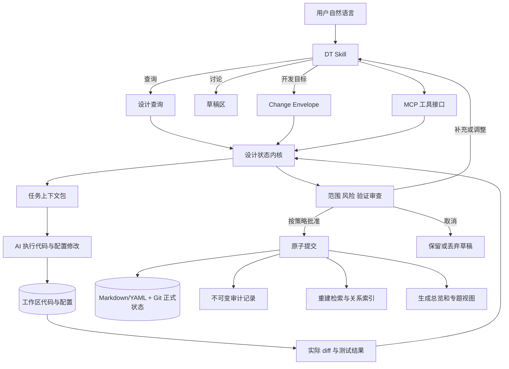
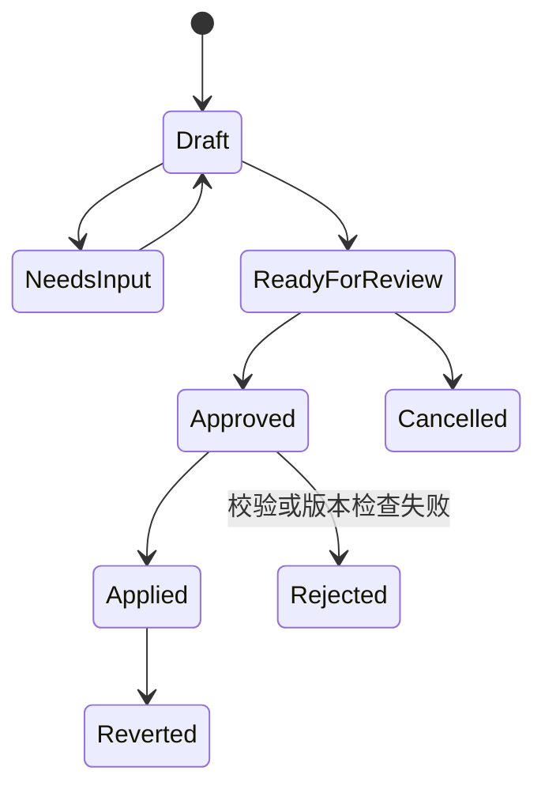
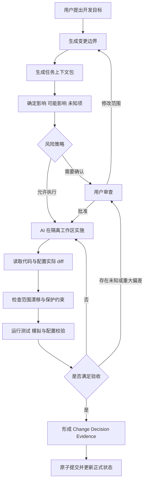
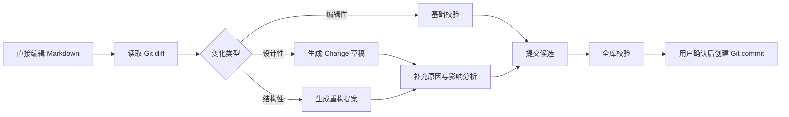
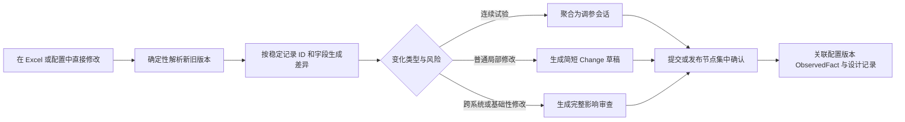
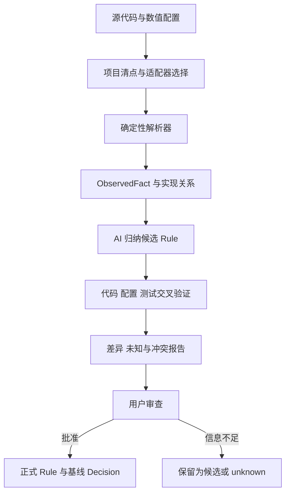

# Design Trace：产品设计与开发计划

> 文档状态：方案草案 v0.6  
> 更新日期：2026-09-17  
> 适用阶段：概念验证、个人 MVP、插件化产品  
> 当前假设：单用户、本地优先、一个游戏项目、通过 Codex/Claude 等 Agent 使用

## 1. 文档目的

本文档记录 Design Trace（内部简称 DT）的产品目标、架构决策、数据模型、交互流程、风险控制和开发路线，作为后续原型、评审和迭代的共同基线。

该产品希望解决以下实际问题：

- 设计文档颗粒度不一致，有些过大，有些过小。
- 设计修改覆盖旧内容，无法还原变更过程。
- 设计结论缺少理由、备选方案和证据。
- 修改一项设计后，无法判断对其他系统的影响。
- AI 每次获得的上下文不同，回答和修改缺乏稳定性。
- 正式设计、讨论草稿、历史决定和 AI 推测容易混在一起。
- 策划通常直接在 Excel、配置编辑器或代码中完成修改，不会先进入独立系统登记意图和原因。

## 2. 产品定位

Design Trace 是一个面向 AI 游戏开发的设计与实现变更控制系统。它以变更事务为核心，在 AI 执行代码、配置和设计修改之前提供必要上下文与边界，在执行之后核对实际差异、验证结果和设计状态。

DT 的第一目标不是生成更多设计文档，而是让 AI 的每次重要修改都满足：知道当前设计、理解历史原因、明确本次边界、暴露潜在和未知风险、实施后验证偏差，并留下可追溯、可审查、可回退的记录。

Markdown 设计库、关系图和生成文档是这一控制过程的依据与产物，不是产品本身的最终目的。

用户只需要完成七类操作：

1. 用自然语言说明希望 AI 完成的目标。
2. 询问当前设计。
3. 查询某项设计的原因和历史。
4. 讨论或探索设计方案。
5. 审查重大修改的边界、风险和结果。
6. 查询影响、验证结果或回退历史修改。
7. 从现有源代码和数值配置建立可追溯的设计基线。

Rule、Decision、Change、关系图、版本、检索策略和存储结构由系统内部管理。普通用户不需要理解 Atom、frontmatter、数据库表或 MCP 工具。

## 3. 成功标准

首个可用版本需要证明以下闭环成立：

> 用户向 AI 提出一个真实游戏开发目标后，系统能够建立有边界的变更事务，向 AI 提供最小充分上下文，区分确定、可能和未知影响；AI 完成实施后，系统能够核对原始意图、计划、实际 diff 和验证结果，并以一次可追溯、可回退的事务保存结果。

具体标准：

- 查询结果能够指向当前有效规则和依据。
- 正式设计变更必须符合当前风险策略；MVP 默认要求明确确认，后续允许低风险变更自动通过。
- 一次修改要么全部生效，要么完全不生效。
- 旧决策不会被新内容覆盖。
- 任意已生效修改可以查看历史并发起回退。
- 影响分析明确区分“确定”“可能”和“未知”。
- 从实现中提取的事实能够追溯到代码版本、文件、符号或配置键。
- 系统不会根据实现细节虚构原始设计原因。
- 用户可以使用自然语言，也可以直接编辑 Markdown；两种入口最终遵守同一套校验和提交规则。
- 用户直接修改 Excel、配置或代码后，系统能够从差异生成变更草稿，不要求用户事前重复申报已经由修改行为表达的信息。
- AI 实施超出已确认范围、违反保护约束或缺少验证时，系统能够阻止正式提交或明确要求人工确认。

## 4. 核心设计原则

### 4.1 单一正式状态

正式设计只有一个权威来源。总览、专题文档、关系图和 AI 上下文均为派生视图，不允许形成另一套需要人工同步的正式内容。

### 4.2 当前状态与历史原因分离

- Rule 表示当前有效设计。
- Decision 表示当时为什么做出选择。
- Change 表示一次从旧状态到新状态的修改事务。

三者不得混为同一种记录。

### 4.3 AI 提案，程序提交

AI 可以理解意图、拆分候选规则、提出关系、分析潜在影响和解释结果。AI 不得直接修改正式状态。

所有正式修改必须通过确定性状态内核，并经过校验、版本检查和用户确认。

### 4.4 推测必须可见

系统不得把 AI 推测写成已确认事实，也不得把“没有找到关系”解释为“没有影响”。

### 4.5 先解决高价值决策

系统不追求把所有文本拆成 Atom。只有可独立修改、审批、验收、引用或产生独立影响的内容，才值得成为正式 Rule。

### 4.6 索引可以重建

全文索引、向量索引、关系缓存和生成文档都应可以从正式状态重新构建，避免索引成为第二真源。

### 4.7 不改变用户的主要工作面

DT 不应要求策划为了留下记录而放弃 Excel、配置编辑器、代码编辑器或现有发布流程。系统同时支持两条路径：重大修改可以先讨论意图再执行；日常修改可以先在原工具中发生，再由 DT 检测差异、生成草稿并在合适的提交节点补齐记录。

用户已经通过实际 diff 表达的修改内容，不得要求其再次手工描述。DT 只追问无法从差异恢复的信息，例如原因、目标、证据和例外。

### 4.8 审查摩擦与变更风险匹配

本地探索和连续调参默认不被逐次打断。编辑性修改只做基础校验；普通局部修改采用简短确认；跨系统或基础性修改才进入完整原因、影响和验证审查。审查优先发生在提交配置、上传测试环境、合并分支或发布版本等自然边界，而不是每次保存文件时。

### 4.9 文档服务于行动

DT 不以文档数量、Atom 数量或关系数量衡量成功。正式资料用于支持当前判断、限制错误修改并解释历史。面向人类的总览、专题页和面向 AI 的任务上下文包都由正式状态按需生成，避免要求人或模型每次阅读完整 GDD。

### 4.10 计划、执行与验证分离

用户指令只代表原始意图，AI 提出的方案只代表候选计划，代码和配置 diff 只代表实际实现，测试与试玩只代表验证证据。DT 必须分别记录并核对这四层，不能因为 AI 声称“已经完成”就视为目标已经实现，也不能让同一次模型判断替代确定性校验和风险策略。

## 5. 产品形态

理想形态是插件化的 Design Trace，内部由 Skill、MCP 服务、状态内核和可选界面组成。



### 5.1 Skill 的职责

- 理解自然语言和用户意图。
- 判断请求属于查询、讨论、提案、审批、历史查询还是回退。
- 从讨论中提取候选规则、理由、备选方案和证据。
- 将用户目标整理为 Change Envelope，并请求状态内核生成任务上下文包。
- 建议合理的规则颗粒度。
- 提出潜在的间接影响。
- 只追问会影响决策或验收的必要信息。
- 将程序返回的结构化结果解释为用户可理解的语言。

### 5.2 MCP 服务与状态内核的职责

- 生成稳定且唯一的 ID。
- 执行 Schema 和状态机约束。
- 读取当前有效版本。
- 计算修改前后差异。
- 绑定实际代码与配置 diff，检查实施范围漂移和保护约束。
- 执行风险策略，不能接受执行模型自行提供的批准结论。
- 记录测试、模拟和人工验收证据。
- 遍历显式依赖和反向依赖。
- 校验重复、冲突、断链和过期关系。
- 执行原子提交、审计和回滚。
- 管理文档 Schema、Git 状态边界和索引重建。
- 阻止基于过期版本的提案提交。

### 5.3 AI 执行器的职责

- 在 Change Envelope 允许的范围内修改代码、配置、测试和必要文档。
- 使用任务上下文包中的约束、来源和验收条件，不自行扩大目标。
- 在遇到范围外修改、关键未知项或保护约束冲突时停止并请求重新确认。
- 返回执行状态，但不把自己的总结当作完成证据；实际 diff 与测试结果由状态内核独立读取。
- 不直接批准 Change，不绕过正式提交和审计流程。

AI 执行器可以是 Codex、Claude Code 或其他能够操作项目文件和运行测试的 Agent。DT 不绑定单一模型供应商。

### 5.4 用户界面的职责

- 展示变更前后差异。
- 展示修改原因和依据。
- 分开展示确定影响、可能影响和未知项。
- 展示验证建议和校验结果。
- 提供确认、补充、取消和回退操作。

第一版不需要完整桌面应用。聊天中的结构化变更卡可以承担最初的审查界面。

## 6. 领域模型

### 6.1 Rule：当前有效规则

回答“游戏现在如何运作”。

建议字段：

```yaml
id: RULE-COMBAT-GLOBAL-COOLDOWN
title: 主动技能全局冷却
status: active
system: combat
owner: combat-design
statement: 所有主动技能共享 0.6 秒全局冷却
scope: 所有可主动释放的玩家技能
exceptions:
  - 被动技能
  - 独立定义的终极技能
acceptance:
  - 冷却期间不能释放其他主动技能
version: 3
updated_at: 2026-09-17
```

Rule 可以通过 Change 修改。Rule 的历史版本必须保留。

### 6.2 Decision：不可覆盖的决策记录

回答“为什么选择当前方案”。

建议字段：

```yaml
id: DEC-COMBAT-023
status: accepted
targets:
  - RULE-COMBAT-GLOBAL-COOLDOWN
context: 测试玩家认为连续技能释放缺少决策节奏
options:
  - 0.4 秒全局冷却
  - 0.6 秒全局冷却
  - 每个技能完全独立冷却
decision: 采用 0.6 秒全局冷却
rationale: 保留响应速度，同时限制无脑连续输入
tradeoffs:
  - 降低连续输入自由度
evidence:
  - EVD-PLAYTEST-018
supersedes: DEC-COMBAT-017
created_at: 2026-09-17
```

Decision 创建后只追加，不覆盖。新决定通过 `supersedes` 取代旧决定。

### 6.3 Change：设计修改事务

回答“准备修改什么，以及如何安全生效”。

建议字段：

```yaml
id: CHG-COMBAT-041
status: proposed
baseline_version: 127
origin: user_instruction
request: 缩短前十分钟战斗时长，但不要降低构筑差异
goal:
  - 前十分钟平均战斗时长下降
in_scope:
  - 初期敌人属性
  - 初期技能能量参数
out_of_scope:
  - 装备词条系统
  - 后期难度曲线
protected_invariants:
  - 旧存档能够正常读取
  - 不降低不同构筑之间的差异
targets:
  - RULE-COMBAT-GLOBAL-COOLDOWN
before:
  value: 0.6
after:
  value: 0.4
reason: 测试反馈认为战斗响应迟钝
decision: DEC-COMBAT-024
risk_level: medium
acceptance:
  - 相关自动测试通过
  - 实际 diff 不超出本次范围
implementation_refs: []
created_at: 2026-09-17
```

其中 `request`、`goal`、`in_scope`、`out_of_scope`、`protected_invariants`、`risk_level` 和 `acceptance` 共同构成“变更边界”（Change Envelope）。它不是另一种独立文档，而是 Change 在执行前必须具备的最小控制信息。

变更边界的作用是限制 AI 的实施范围，而不是要求用户完整填写表单。DT 应从用户指令、现有 Rule、历史 Decision 和项目约束中生成候选内容，只追问真正影响执行或验收的信息。

Change 状态：



### 6.4 Evidence：设计依据

Evidence 可以是：

- 玩家测试记录
- 数据分析
- 用户反馈
- 会议纪要
- 原型结果
- 外部参考
- 制作或技术约束

Evidence 必须记录来源、采集时间和适用范围。AI 总结不能替代原始 Evidence。

### 6.5 ObservedFact：从实现中观察到的事实

ObservedFact 回答“指定代码和配置版本实际上做了什么”。它是反推设计基线的中间产物，不等同于正式 Rule，也不能证明原始设计原因。

建议字段：

```yaml
id: OBS-ECONOMY-DEATH-PENALTY
type: observed_fact
statement: 玩家死亡时扣除当前金币的 10%
source:
  revision: a1b2c3d
  path: src/economy/death_penalty.cs
  symbol: ApplyDeathPenalty
  config_key: death_penalty.percent
environment: default-development
extractor: static-code-and-config
confidence: confirmed
status: current
observed_at: 2026-09-17
```

ObservedFact 必须绑定来源版本和运行环境。代码或配置变化后，相关事实应标记为 `stale` 并重新提取。

AI 可以根据 ObservedFact 生成候选 Rule，但候选 Rule 只有经过核对和批准后才能进入正式设计。无法从实现中恢复的设计原因必须保留为 `unknown`。

### 6.6 Relation：规则关系

第一版只支持少量明确关系：

- `depends_on`：本规则依赖另一规则成立。
- `affects`：修改本规则会直接影响另一规则。
- `constrained_by`：本规则受另一规则约束。
- `conflicts_with`：两条规则存在冲突。
- `supersedes`：新决定或规则取代旧记录。

每条关系需要保存来源：

```yaml
from: RULE-COMBAT-DODGE
to: RULE-EQUIPMENT-DODGE-BONUS
type: affects
source: ai_inferred
confidence: 0.72
status: unverified
last_verified_at: null
```

来源类型建议包括：

- `explicit`：用户或设计者明确声明。
- `deterministic`：由引用、字段或程序规则确定。
- `ai_inferred`：由 AI 根据语义推测。

只有 `explicit` 和已验证的 `deterministic` 关系可以作为“确定影响”。

## 7. 颗粒度规则

一项内容适合成为独立 Rule，应至少满足以下一项：

- 可以独立修改、批准或废弃。
- 有独立的验收方法。
- 有独立的设计原因。
- 被多个系统引用。
- 修改时具有独立的影响范围。

以下内容通常不应独立成为 Rule：

- 单个技能的普通数值。
- 没有结论的临时讨论。
- 离开上下文无法理解的片段。
- 永远与另一条规则同步修改的细节。
- 纯说明文字或重复摘要。

AI 可以提出拆分或合并建议，但这些建议必须作为独立 Change 进入审查，不能自动重构正式状态。

系统后期可以增加知识健康检查：

- 一条 Rule 是否包含多个可独立变化的决定。
- 多条 Rule 是否总是一起变化，适合合并。
- 是否存在语义重复或互相冲突的 Rule。
- 是否存在长期未引用、未验证或已过期的 Rule。

## 8. 用户交互流程

### 8.1 AI 游戏开发主流程

这是 DT 的主要产品路径：



任务上下文包是根据当前 Change 临时生成的只读视图，至少包含：

- 原始用户目标，以及本次明确不做的内容。
- 与任务直接相关的当前 Rule。
- 必须保持的项目级约束和保护条件。
- 相关历史 Decision、已失败方案和 Evidence。
- 已验证依赖、可能影响和当前未知项。
- 相关代码、配置、测试入口和来源版本。
- 本次验收条件。

任务上下文包不是新的真源，任务结束后可以重新生成。它的目标是让 AI 获得最小充分上下文，而不是把完整 GDD、全部 Atom 或整个关系图塞入模型上下文。

实施结束后，DT 必须核对四层信息：原始用户意图、批准的变更边界、实际代码与配置 diff、测试或试玩证据。发现超范围修改、保护约束被破坏、未验证断言或实现与设计冲突时，不得直接宣告完成。

### 8.2 自治与确认等级

DT 支持不同的执行策略，但所有等级都必须保留实际 diff、校验结果和回退能力：

| 等级 | 行为 | 适用场景 |
|---|---|---|
| 建议模式 | AI 提出方案，用户确认后才实施 | 新项目、陌生系统、高风险修改 |
| 监督模式 | 低风险修改可实施后汇总，重大修改在实施或提交前确认 | 默认推荐模式 |
| 自治模式 | AI 在隔离分支连续实施和验证，在合并或发布前集中确认 | 成熟规则、测试充分的项目 |

MVP 使用建议模式与监督模式，不实现无人监督发布。审批权由确定性风险策略决定，不能由执行修改的模型自行宣告风险可接受。

### 8.3 查询当前设计

用户：

> 当前死亡惩罚是什么？

系统读取当前 Rule，返回结论、适用范围、例外、来源和最后更新时间，不创建新记录。

### 8.4 查询设计原因

用户：

> 为什么死亡会损失 10% 金币？

系统沿 Rule 查找当前 Decision、被取代的历史 Decision 和 Evidence，说明当时的背景、方案比较和取舍。

### 8.5 讨论设计

用户：

> 如果降低死亡惩罚，会发生什么？

系统进行分析并保留为草稿。讨论、假设和候选方案不改变正式状态。

### 8.6 修改设计

用户：

> 普通模式死亡损失改为 5%，困难模式保持 10%，因为新手阶段流失过高。

系统生成变更审查卡：

```text
修改前
- 普通模式：损失 10%
- 困难模式：损失 10%

修改后
- 普通模式：损失 5%
- 困难模式：损失 10%

修改原因
新手阶段流失过高。

确定影响
- 死亡结算规则
- 新手教程文案

可能影响
- 金币回收速度
- 复活道具价值

未知
- 当前测试数据是否区分难度

验证建议
- 比较修改前后前两小时金币净流量
- 检查复活道具购买率
```

系统只有在用户明确确认后才能提交。

### 8.7 直接编辑 Markdown

用户可以在任意编辑器中直接修改 Rule、Decision、Change 或 Evidence 文档。系统将工作区解释为两个层次：

```text
最后一次通过校验的 Git commit = 当前正式设计
尚未提交的 Markdown 修改       = 工作草稿
```

DT 读取 Git diff 后，将修改分成三类：

- 编辑性修改：错别字、格式、链接和不改变语义的表达优化，只需要基础校验。
- 设计性修改：规则、数值、范围、例外、验收条件或关系变化，必须形成 Change；只有改变设计意图或重要取舍时才补充 Decision，普通调参和纠错可以聚合记录。
- 结构性修改：Rule 的拆分、合并、删除和系统边界调整，需要独立重构提案和完整影响检查。

直接编辑的处理流程：



系统应支持从现有 diff 生成变更提案，避免要求用户撤销手工修改后再重复操作。无法确定是否改变语义时，系统将其标记为待确认，不能自行按编辑性修改处理。

### 8.8 外部工具修改与事后接管

策划可以直接在 Excel、配置编辑器或代码中修改实现。DT 不要求用户先申报修改，而是在能够获得稳定版本差异时执行：



处理要求：

- 差异使用工作表、稳定记录 ID、字段名和新旧值定位，不能只依赖易漂移的单元格坐标或行号。
- 已能从差异读取的修改内容自动填入，不要求用户再用自然语言重复描述。
- 原因无法从实现中恢复时保持 `unknown`，只允许用户补充，AI 不得猜测并写成事实。
- 连续试验性调参按一次调参会话或一次候选 Change 聚合；中间值可以保留在文件历史中，但不为每个单元格、每次保存创建 Decision。
- 只有改变设计意图、系统边界或重要约束的数值变化才提升为正式设计 Decision；普通数值状态仍可以作为 ObservedFact 和 Change 明细追踪。
- 本地探索默认不阻断。系统在配置提交、测试环境上传、分支合并或版本发布等自然边界集中审查；具体阻断策略按风险配置。
- 紧急修改可以先进入实现，但必须留下“未解释实现变更”，在后续对账中持续可见，不能自动补造原因。

这一路径称为“修改优先”；用户在修改前主动与 DT 讨论方案称为“意图优先”。两条路径最终进入同一套校验、对账和正式状态流程。

### 8.9 正式提交

提交顺序：

1. 检查提案记录的基线 commit。
2. 检查目标 Rule 是否仍为当前版本。
3. 将程序修改与用户直接编辑合并成完整候选文件集。
4. 校验 Rule、Decision、Change、Evidence 和 Relation。
5. 检查唯一 ID、断链、状态、重复和不完整记录。
6. 将本次变更涉及的文件作为一个 Git commit 提交。
7. 重建派生索引和视图。
8. 返回变更编号、commit 和验证事项。

Git commit 是正式状态边界。提交前即使工作区处于不完整状态，也不会改变上一版正式设计。派生索引重建失败不能破坏已提交的正式状态，但必须明确标记系统处于“索引待修复”状态，查询时回退到直接读取 Markdown 或报告索引不可用。

### 8.10 回退

回退本身也是新的 Change，而不是删除历史。

系统读取目标 Change 的反向操作，生成回退提案，重新分析当前影响并等待用户确认。若后续修改已经依赖该 Change，系统必须提示冲突，不能直接回退。

## 9. 影响分析

影响结果分为三层：

### 9.1 确定影响

来源：

- 已验证的显式关系。
- 反向依赖。
- Schema、外键、ID 或字段引用。
- 确定性程序规则。

### 9.2 可能影响

来源：

- 语义检索。
- AI 对相似规则、术语和历史变更的推断。
- 尚未验证的关系。

### 9.3 未知影响

出现以下情况时必须明确展示未知：

- 某个相关系统尚未录入。
- 关系索引不完整或过期。
- 现有 Evidence 无法判断。
- 规则引用存在歧义。
- 影响分析工具执行失败。

第一版只实现显式关系与反向遍历。向量检索和自动关系发现放在后续阶段。

## 10. 实现反推与设计—实现对账

### 10.1 能力边界

源代码和数值配置可以恢复实现事实、公式、状态、引用和边界条件，通常无法恢复原始设计意图、被放弃的方案、计划但未实现的内容或目标玩家体验。

系统生成的是“实现反推的设计基线”，而不是声称还原完整原始设计文档。

### 10.2 反推流水线



优先提取：

- 配置 Schema、默认值、范围和覆盖关系。
- ID、枚举、实体和表之间的引用。
- 伤害、掉落、成长、冷却等确定性公式。
- 状态机、事件流和触发条件。
- 自动测试中的业务断言。
- Feature Flag、难度、平台和环境分支。

实现方式应优先使用配置解析器、AST、引用扫描和测试等确定性手段。AI 负责归纳、命名、解释和发现候选关系，不能取代事实提取。

### 10.3 设计—实现对账

正式 Rule 与 ObservedFact 的比较结果分为：

| 状态 | 含义 | 后续动作 |
|---|---|---|
| 一致 | 正式设计与实现匹配 | 保留证据和版本 |
| 仅设计存在 | 设计可能尚未实现或实现已删除 | 创建实现任务或确认废弃 |
| 仅实现存在 | 存在未文档化的实现规则 | 生成候选 Rule |
| 冲突 | 实现行为与正式设计不同 | 修复实现或补建 Change/Decision |
| 无法判断 | 动态覆盖、环境差异或资料不足 | 保留 unknown 并请求证据 |

对账结果本身不自动修改设计或代码。用户需要明确选择实现有误、设计已变更或暂时保留。

### 10.4 运行时真实性限制

静态代码和仓库配置不一定等于最终运行行为。系统必须识别并记录：

- 服务端、客户端和热更新配置的覆盖顺序。
- 不同构建环境、平台、难度和活动配置。
- Feature Flag 和已废弃但仍存在的代码。
- 公式、Buff、装备和运行时脚本的二次修正。
- 生成配置与原始配置之间的转换。

每次反推都绑定代码 revision、配置版本、目标环境和提取器版本。不能确定最终值时，输出候选区间或 unknown，不能选择一个看似合理的值。

## 11. 存储与索引

### 11.1 唯一真源：Markdown/YAML + Git

第一版和后续可预见阶段均以 Markdown/YAML + Git 作为正式状态：

- Rule、Decision、Change、Evidence、ObservedFact 和 Relation 保存在结构化 Markdown 中。
- Git commit 表示一版完整、通过校验的正式设计。
- 未提交修改属于草稿，可以由用户直接编辑或由 AI 生成。
- 稳定 ID 用于引用，文件名和目录可以调整，但不能改变对象身份。
- Change 和 Decision 记录设计历史，Git 保存文件层面的修改历史。
- 总览、专题页、manifest 和关系图均从正式文档生成。

建议目录：

```text
design/
├─ rules/
│  ├─ combat/
│  ├─ economy/
│  └─ progression/
├─ decisions/
├─ changes/
├─ evidence/
├─ observations/
├─ project.yaml
└─ .generated/
   ├─ manifest.json
   ├─ relations.json
   └─ index.sqlite        # 后续可选，可随时重建
```

Markdown/Git 的主要限制是多文件写入、查询性能、多人冲突和约束执行弱于数据库。第一版通过“上一有效 commit 是正式状态”、提交前全库校验、稳定 ID 和生成索引来控制这些问题。

### 11.2 文档格式约束

机器字段与自由说明应分离。推荐格式：

```markdown
---
id: RULE-COMBAT-GLOBAL-COOLDOWN
status: active
system: combat
version: 3
depends_on:
  - RULE-COMBAT-INPUT-BUFFER
affects:
  - RULE-SKILL-DPS
---

# 主动技能全局冷却

## 当前规则

所有主动技能共享 0.6 秒全局冷却。

## 适用范围

适用于所有玩家主动技能。

## 例外

- 被动技能
- 独立定义的终极技能

## 验收条件

- 冷却期间不能释放其他主动技能
- UI 必须显示剩余冷却时间
```

这样既允许人直接编辑，也能让程序可靠解析关键字段和规范章节。

### 11.3 派生索引与 SQLite 引入条件

第一版使用生成的 JSON manifest、全文扫描和关系缓存。SQLite 暂缓引入，未来只作为可重建索引，不作为正式真源。

出现以下需求时再评估 SQLite/FTS：

- 文件扫描已经影响交互速度。
- 反向依赖和多层影响查询明显变慢。
- 需要复杂筛选、统计或全文搜索。
- 需要向量检索或大型关系图。
- 需要为多人协作提供统一查询服务。

数据流保持单向：

```text
Markdown/YAML + Git 真源
        ↓
解析与全库校验
        ↓
manifest / 关系缓存 / 可选 SQLite 索引
```

任何索引损坏后都可以从正式文档重新生成，禁止把索引变化反向同步为正式设计。

## 12. MCP 工具接口

建议的内部工具：

```text
query_design
get_rule
get_rule_history
search_evidence
begin_change
build_change_envelope
build_task_context
analyze_impact
scan_implementation
extract_observed_facts
reconcile_design_implementation
mark_observations_stale
inspect_worktree_changes
propose_change_from_diff
propose_change
attach_execution_diff
check_scope_drift
record_validation
validate_change
approve_change
commit_change
propose_revert
commit_revert
check_knowledge_health
rebuild_indexes
```

约束：

- 查询工具只读。
- `propose_change` 只能生成草稿。
- `build_task_context` 只生成当前任务的派生上下文，不得形成第二真源。
- `attach_execution_diff` 必须读取实际文件变化，不能接受模型自行概括的 diff 作为事实。
- `check_scope_drift` 必须区分确定的越界修改与 AI 推测的潜在越界。
- `commit_change` 必须接收有效提案、当前版本和确认凭证。
- `commit_revert` 遵守与普通修改相同的审查流程。
- 任何工具都不能覆盖 Decision 历史。
- 所有写操作必须追加审计事件。

在聊天原型中，可以用明确的“确认应用”作为确认条件。正式插件应由审查界面的确认按钮直接触发批准，降低 AI 误判用户意图的可能。

## 13. 插件结构

目标结构示例：

```text
design-trace/
├─ .codex-plugin/
│  └─ plugin.json
├─ skills/
│  └─ design-trace/
│     └─ SKILL.md
├─ mcp-server/
├─ schemas/
├─ migrations/
├─ templates/
├─ extractors/
├─ ui/
└─ docs/
```

MCP 服务应保持平台无关。Codex、Claude Code 或其他 Agent 通过各自的 Skill/适配器调用同一个状态内核。

## 14. 开发路线

### 阶段 0：真实任务验证

范围：一个游戏项目中的一个高频变更系统，例如战斗、成长或经济。

准备：

- 录入 10～20 条关键 Rule。
- 选择 3～5 条真实历史 Decision。
- 建立少量明确 Relation。
- 选择一组真实配置或一个边界清晰的代码模块作为反推样本。
- 准备九个真实用户任务。

验证任务：

1. 查询当前规则。
2. 查询设计原因。
3. 用一句自然语言要求 AI 完成局部游戏修改，由 DT 自动建立变更边界和任务上下文包。
4. 让 AI 实施该修改，并核对原始意图、批准范围、实际 diff 和验证结果。
5. 故意诱发一次超范围实现，验证 DT 能识别并阻止直接提交。
6. 查看跨系统影响并明确区分确定、可能和未知。
7. 从配置或代码提取实现事实，并与一条正式 Rule 对账。
8. 不事前通知 DT，直接在真实 Excel 或配置中完成一轮连续调参，再由 DT 检测、聚合并生成待审查记录。
9. 回退一次已经包含代码或配置实施结果的 Change，并验证设计状态与实现状态一致恢复。

退出条件：

- 用户既可以自然语言操作，也可以直接修改 Markdown。
- 用户不需要理解 Rule、Decision、Change 或关系图即可完成一次 AI 开发闭环。
- 所有查询都能显示依据。
- 修改必须经过确认。
- 历史能够完整恢复。
- 影响结果能区分确定、可能和未知。
- AI 只获得与当前任务相关的最小上下文，并能引用其来源。
- 实际 diff 超出变更边界或违反保护约束时，系统会阻止正式提交或要求重新确认。
- AI 声称完成但测试、配置或实际 diff 不支持时，系统不会将任务标记为完成。
- 反推事实能够回到具体代码或配置来源，未知设计原因不会被自动补写。
- 修改优先路径不要求用户重复描述 diff 已包含的内容，连续调参不会产生逐单元格的 Decision。

### 阶段 1：Markdown/Git 状态内核

交付：

- Markdown/YAML Schema、解析器与版本迁移机制。
- Rule、Decision、Change、Evidence、ObservedFact、Relation 模型。
- Change Envelope 字段及其完整性、风险等级和状态转换规则。
- 用户意图、候选计划、实际 diff 与验证证据的分层存储。
- 以 Git commit 为边界的状态机和版本检查。
- 工作区 diff 检测，以及编辑性、设计性和结构性修改分类。
- 从直接编辑生成 Change/Decision 草稿。
- 提交前全库校验、审计和回滚。
- manifest 与关系缓存生成。
- Schema、断链和唯一性校验。

关键测试：

- 提交中途失败不会改变上一有效 commit。
- 未提交的直接编辑能够保留并重新进入审查流程。
- 过期提案不能覆盖新版本。
- Decision 不可覆盖。
- 回滚后当前状态正确且历史完整。
- 重复 ID、非法状态和断链能够被阻止。

### 阶段 2：MCP 服务与单一 Skill

交付：

- 本地 MCP 服务。
- 查询、提案、校验、提交和回退工具。
- 变更边界、任务上下文包、实施 diff 绑定、范围漂移检查和验证结果记录工具。
- 一个用户可见的 DT Skill。
- 自然语言意图分类。
- 查询回答中的来源和版本信息。
- 聊天形式的变更审查卡。
- 建议模式与监督模式的风险策略；不允许执行模型自行批准高风险修改。

退出条件：用户用一句自然语言提出目标后，AI 能在 DT 提供的边界和上下文中实施修改；DT 能以实际 diff 和验证结果为准检查偏离，AI 无法仅凭文字声明绕过状态内核写入正式状态。

### 阶段 3：实现反推与设计对账

交付：

- 项目清点和来源版本记录。
- 一种常用配置格式的确定性提取器。
- 配置新旧版本差异检测，使用稳定记录 ID 和字段定位变化。
- 修改优先接管：从 Excel 或配置差异生成 Change 草稿。
- 连续调参聚合，以及提交、测试上传或发布节点的集中审查。
- 一种目标语言或游戏引擎的有限代码提取器。
- ObservedFact 生成、过期检测和来源跳转。
- 从 ObservedFact 生成候选 Rule。
- 设计—实现对账报告。
- 一致、仅设计、仅实现、冲突和无法判断五类结果。

退出条件：从一个真实系统中提取 20～50 条可追溯事实，能够发现至少一类设计—实现差异，且所有结论都能回到具体来源。

### 阶段 4：影响分析

交付：

- 显式关系管理。
- 正向与反向关系遍历。
- 一层和二层影响查询。
- 循环依赖、冲突和过期关系检查。
- 关系来源、可信度和验证状态。

后续增量：全文检索、语义检索、关系候选发现和重排序。

### 阶段 5：审查界面

首版页面：

- 对话。
- 待确认变更。
- 当前设计。
- 历史时间线。
- 设计—实现对账。

核心组件：

- 变更前后差异。
- 原因和 Evidence。
- 确定、可能、未知影响。
- 校验结果。
- 确认、补充、取消和回退。

关系图属于辅助视图，可以晚于变更审查卡开发。

### 阶段 6：插件打包

交付：

- 插件 manifest。
- Skill、MCP 服务、Schema、迁移和 UI 打包。
- 项目创建与初始化流程。
- 本地数据备份、恢复与升级流程。
- 跨 Agent 适配说明。

### 阶段 7：真实项目试用

至少运行两个完整设计迭代，记录：

- 查询正确率和漏召回情况。
- 影响分析遗漏。
- AI 推测关系的确认率。
- 变更提案退回率。
- Rule 拆分和合并次数。
- stale、重复和冲突记录数量。
- 每次修改的时间成本。
- 未经事前申报但被 DT 成功捕获的配置修改比例。
- 调参会话被聚合前后的记录数量和用户确认次数。
- 用户绕过、忽略或关闭 DT 审查的次数及原因。
- 回退是否能够真实使用。
- ObservedFact 的提取准确率和来源覆盖率。
- 设计—实现冲突的有效发现数量。

根据试用结果决定是否投入向量检索、多人协作和云同步。

## 15. 开发周期粗估

假设由一名熟悉 AI 辅助开发的开发者完成：

| 里程碑 | 粗略周期 |
|---|---:|
| 真实任务原型 | 1～2 周 |
| 状态内核与 MCP 个人 MVP | 累计 4～6 周 |
| 单一配置格式与有限代码反推 | 累计 6～9 周 |
| 审查界面与插件打包 | 累计 10～14 周 |
| 多人协作与生产级权限 | 另行评估 |

周期受旧资料迁移量、界面复杂度、跨平台要求和多人协作需求影响。最大的工程成本预计来自状态一致性、历史迁移、关系可信度和异常恢复，而不是自然语言对话。

## 16. MVP 范围

### 16.1 必须跑通的纵向闭环

首个 MVP 只选择一个真实游戏项目和一个边界清晰的系统，完整实现：

1. 用户用自然语言提出一项局部游戏开发目标。
2. DT 生成可修改的 Change Envelope，并提取最小任务上下文包。
3. 基于显式关系输出确定、可能和未知影响。
4. 用户确认后，AI 在独立分支或工作区修改代码与配置。
5. DT 读取实际 diff，检查是否超范围或破坏保护约束。
6. 运行现有测试和至少一种领域校验。
7. 用户审查最终差异、验证结果和未解决风险。
8. DT 原子提交 Change、必要的 Decision、Evidence 和实现引用。
9. 用户可以查询原因、查看全过程并执行回退。

MVP 的首要验收对象是一条真实 AI 开发任务能否被安全闭环，而不是文档生成量、关系图规模或支持的游戏系统数量。

### 16.2 首版不包含

以下功能不进入首个 MVP：

- 全自动拆分全部旧文档。
- 一次性自动生成完整 GDD。
- 首版支持任意语言、引擎和私有配置格式。
- 根据实现自动编造设计原因或备选方案。
- AI 自动批准正式设计修改。
- 无确认批量提交。
- 复杂知识图谱可视化。
- 多模型自动协商。
- 云端多人实时协作。
- 细粒度企业权限系统。
- 自动修改全部关联 Rule。
- 向量数据库和 GraphRAG。
- 对所有游戏设计领域建立通用本体。

## 17. 风险与应对

### 17.1 过度拆分

风险：规则数量快速膨胀，维护成本超过收益。

应对：只将可独立修改、验收或产生独立影响的内容正式化；定期提出合并建议。

### 17.2 关系图失真

风险：关系缺失、过期或由 AI 错误推断。

应对：记录关系来源、可信度和最后验证时间；推测关系不能进入确定影响。

### 17.3 AI 误解用户意图

风险：讨论被误认为正式修改。

应对：“如果”“讨论”“考虑”等表达默认进入草稿；正式提交必须展示差异并获得明确确认。

### 17.4 检索只见局部

风险：AI 找到相关规则，却遗漏全局原则或系统边界。

应对：查询上下文固定包含项目级约束、目标系统摘要和当前任务相关 Rule；后续引入分层摘要。

### 17.5 双重真源

风险：数据库与人工编辑的总览文档出现冲突。

应对：生成视图只读；正式修改必须通过状态内核。

### 17.6 插件过早产品化

风险：在核心工作流未验证前投入安装、界面和分发。

应对：先完成真实任务原型和状态内核，再进行插件打包。

### 17.7 静态实现不等于运行时行为

风险：仓库中的默认配置被服务器、热更新、Feature Flag 或运行时公式覆盖，导致反推结果错误。

应对：ObservedFact 强制绑定 revision、配置版本和环境；优先使用测试与运行日志交叉验证；无法确定时标记 unknown。

### 17.8 AI 为实现补写虚假设计原因

风险：AI 根据代码行为生成听起来合理、实际不存在的设计动机。

应对：反推流程只生成实现事实和候选 Rule；没有 Evidence 的 rationale 固定为 unknown，必须由人补充或确认。

### 17.9 DT 成为额外审批层

风险：策划已经在 Excel、配置或代码中完成修改，却还要进入 DT 重复申报内容、填写原因并逐项审批，最终绕过或弃用系统。

应对：把现有工具视为主要工作面；默认支持修改后接管；从实际 diff 自动生成草稿；连续调参聚合处理；只在自然提交边界集中审查，并按变更风险增加摩擦。

### 17.10 AI 实施范围失控

风险：用户提出局部需求，AI 为了形成完整方案而新增系统、重构无关模块或修改未授权规则，使任务成本和回归范围迅速扩大。

应对：执行前生成 Change Envelope，明确目标、范围外事项和保护约束；执行后用实际 diff 检查范围漂移。新增范围必须回到提案状态，不能由执行模型自行扩大授权。

### 17.11 任务上下文过载或遗漏

风险：把完整 GDD 和大量 Atom 塞给模型会稀释关键约束；上下文过少又会遗漏全局规则和历史决定。

应对：为每次 Change 生成最小充分任务上下文包，固定包含项目级约束，再按显式关系、来源和任务范围补充局部资料；记录上下文来源，缺失部分明确标为 unknown。

### 17.12 AI 自证完成

风险：同一个 AI 负责计划、实施和总结时，可能把自己的解释当作完成证据，忽略实际 diff、测试失败或未实现部分。

应对：以文件差异、确定性校验、测试与运行结果为准；分别保存用户意图、候选计划、实际实现和验证证据；高风险变更由风险策略要求人工确认，不能由执行模型自行批准。

## 18. 评估指标

### 正确性

- 当前 Rule 查询准确率。
- 回答附带有效依据的比例。
- 过期提案被正确阻止的比例。
- 原子提交和回滚成功率。

### 影响分析

- 确定影响的漏检率。
- AI 潜在影响建议的确认率。
- 被错误标记为确定影响的数量。
- 未知项在后续被补全的比例。

### 知识健康

- 重复 Rule 数量。
- 冲突 Rule 数量。
- stale Rule 和 Relation 数量。
- 拆分、合并和归档频率。

### 使用价值

- 完成一次设计修改的时间。
- DT 为一次普通修改增加的交互时间和中断次数。
- 查询历史原因的时间。
- 变更提案被退回的比例和原因。
- 因影响遗漏造成的返工次数。
- 外部工具修改的自动捕获率、补充原因率和主动绕过率。

### AI 开发控制

- 用户原始目标转化为有效 Change Envelope 的比例。
- AI 实际 diff 超出已确认范围的发现率与误报率。
- 被保护约束或风险策略阻止的错误提交数量。
- AI 声称完成但未满足验收条件的发现数量。
- 一次任务实际提供给 AI 的上下文规模、有效引用率和漏召回情况。
- 任务结束后“用户意图—计划—diff—验证”四层记录的完整率。
- 因 DT 提前发现影响或范围漂移而避免的返工次数。

### 实现反推

- ObservedFact 抽样准确率。
- 事实绑定有效来源的比例。
- 配置和代码覆盖率。
- 设计—实现冲突的确认率。
- 被错误提升为正式 Rule 的候选数量。
- rationale 保持 unknown 而未被 AI 虚构的比例。

## 19. 待确认决策

以下问题留待阶段 0 和阶段 1 决定：

1. 首个试点选择战斗、成长还是经济系统。
2. 首个适配目标只支持 Codex，还是同时支持 Claude Code。
3. Evidence 是否需要直接管理附件，还是只保存外部路径和摘要。
4. 第一版确认机制使用聊天确认，还是立即制作确认按钮。
5. Rule 的正文允许多大程度自由表达，哪些章节必须结构化。
6. 哪些高风险设计修改需要额外审批或强制验证。
7. 首个反推适配的游戏引擎、代码语言和配置格式。
8. 首版是否读取运行日志，还是只处理静态代码、配置和测试。
9. ObservedFact 的抽样验收比例和最低可信度门槛。
10. 首版 Change Envelope 的风险分级阈值和必填保护约束。
11. 首版至少要求哪些验证证据，哪些情况允许记录为 unknown 后继续。
12. AI 实施使用独立分支、工作树还是现有工作区，以及如何拦截未关联 Change 的提交。

## 20. 当前已确定的架构决策

- 正式产品名为 Design Trace，内部简称 DT。
- 产品核心定位是“面向 AI 游戏开发的设计与实现变更控制系统”，而不是文档生成器或通用知识库。
- 用户只面对一个 Design Trace 入口。
- 内部可以存在多个 Skill，但不要求用户选择。
- Skill 负责理解和编排，程序负责正式状态。
- Rule、Decision、Change 分离。
- AI 可以在受控工作区实施代码与配置修改，但只能生成正式状态提案，不能自行批准或绕过状态内核。
- 每次重要 AI 开发任务使用 Change Envelope 约束目标、范围、非目标、保护条件、风险和验收标准。
- DT 按任务生成最小充分上下文包，不要求模型读取完整 GDD；上下文包属于可重建视图。
- 用户意图、候选计划、实际 diff 和验证证据必须分层记录并在提交前核对。
- 所有正式修改必须保留变化类型、已知理由或明确的 `unknown`、历史和回退路径。
- 影响分析必须区分确定、可能和未知。
- 总览、专题页和关系图属于自动生成视图。
- MCP 服务和状态内核应保持平台无关。
- 插件打包在核心闭环验证之后进行。
- Markdown/YAML + Git 是唯一正式真源。
- 用户可以直接编辑 Markdown，未提交修改视为草稿。
- 直接编辑中的语义变化必须在提交前补齐 Change；改变设计意图或重要取舍时再补齐 Decision。
- DT 不作为日常修改的强制前置入口，必须支持“意图优先”和“修改优先”两条路径。
- Excel、配置和代码中的实际 diff 应自动形成变更草稿，用户不重复描述系统已经能够确定的信息。
- 连续试验性调参按会话聚合，不为每次保存或每个单元格生成正式 Decision。
- 审查摩擦与风险匹配，并尽量放在提交、测试上传、合并或发布等自然边界。
- SQLite 暂缓引入，未来只作为可重建索引评估。
- 引入 ObservedFact，明确区分实现事实与正式设计规则。
- 反推结果必须绑定代码 revision、配置版本、环境和来源位置。
- 确定性解析优先于 AI 归纳；AI 只生成候选 Rule 和潜在关系。
- 无法从实现中恢复的设计原因必须保持 unknown。
- 设计—实现对账是正式开发能力，但自动生成完整 GDD 不进入 MVP。

## 21. 版本记录

| 版本 | 日期 | 说明 |
|---|---|---|
| 0.6 | 2026-09-17 | 明确 AI 游戏开发变更控制定位，加入 Change Envelope、任务上下文包、实施后核对、自治等级和 MVP 纵向闭环 |
| 0.5 | 2026-09-17 | 加入修改优先、外部工具差异接管、调参聚合和风险分级审查原则 |
| 0.4 | 2026-09-17 | 产品正式命名为 Design Trace，内部简称 DT |
| 0.3 | 2026-09-17 | 加入代码与配置反推、ObservedFact、设计—实现对账及对应开发阶段 |
| 0.2 | 2026-09-17 | 改为 Markdown/Git 唯一真源；加入直接编辑与 diff 接管流程；SQLite 暂缓为可选索引 |
| 0.1 | 2026-09-17 | 汇总产品设计、架构、领域模型与开发路线 |
