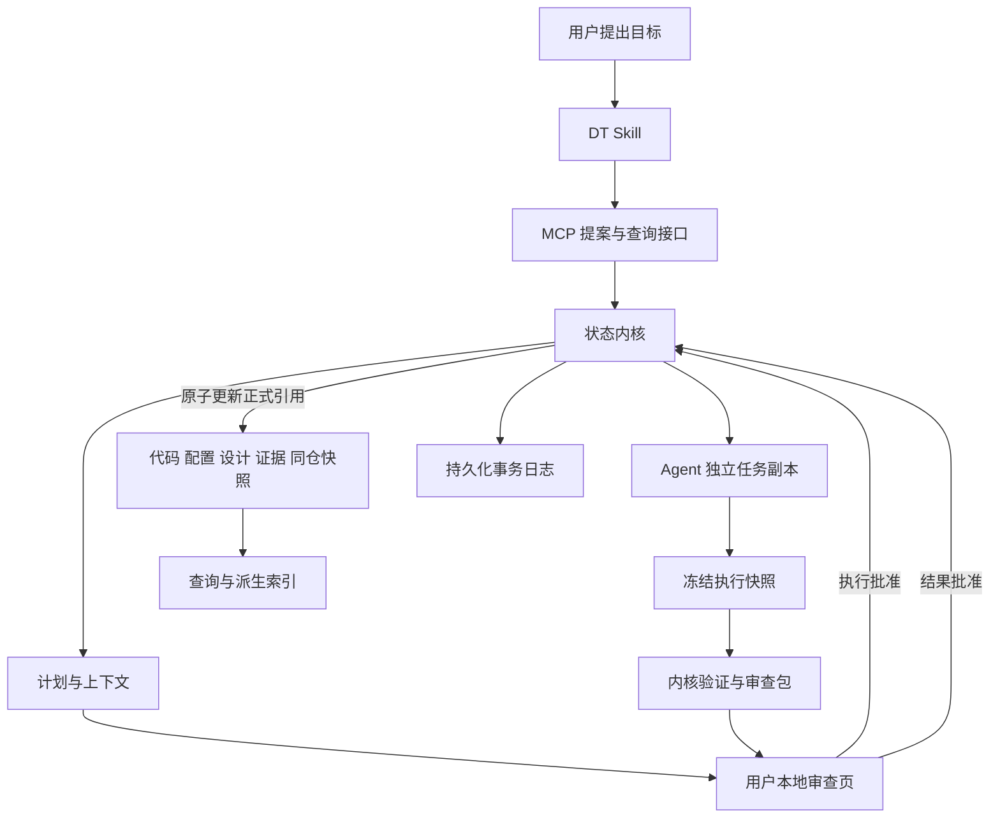
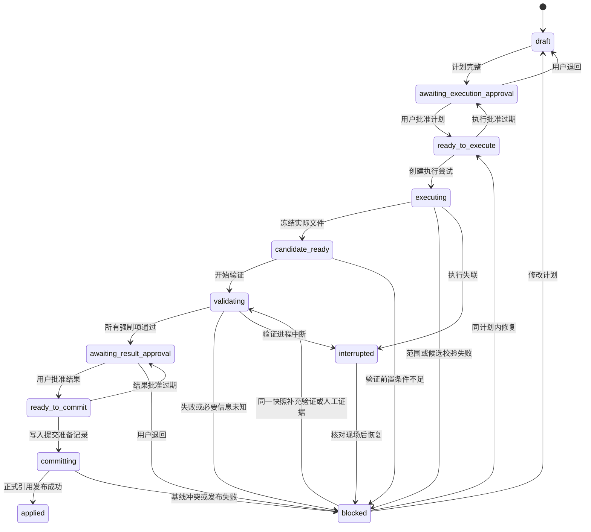

# Design Trace：产品设计与开发计划

> 文档状态：研发基线草案 v0.7  
> 更新日期：2026-09-17  
> 当前阶段：单用户、本地优先、单仓库、单游戏系统、单 Agent 适配  
> 唯一变更入口：用户先说明目标，批准计划后由 AI 实施  
> 实施状态：本文定义研发契约；完成相应验收前，不代表这些保证已经实现

## 1. 产品目的

Design Trace（DT）是面向 AI 游戏开发的设计与实现变更控制系统。它围绕一次用户明确提出的开发目标，提供设计依据、实施边界、验证要求、结果审查和可追溯的提交与回退。

当前需要解决的问题：

- AI 不清楚当前有效规则、历史理由和项目级约束。
- 局部需求在实施中扩大为无关修改。
- 用户指令、候选计划、实际实现和完成声明混在一起。
- 设计与实现不一致，测试结果无法对应最终提交的内容。
- 修改后难以解释原因，也难以安全撤回。

首个产品价值假设：在一个已有配置和测试的真实游戏系统中，DT 能帮助用户发现错误修改、查清修改原因，并以可接受的额外审查成本完成开发任务。阶段 0 和试用阶段需要验证这一假设。

## 2. 当前范围与非目标

### 2.1 唯一产品路径

用户提出目标 → 生成候选计划与上下文 → 用户批准执行计划 → AI 在任务副本中实施 → 内核冻结候选内容并验证 → 用户批准最终结果 → 发布正式仓库快照 → 查询历史或提出回退目标。

用户可以查询、讨论、修改候选计划、审查两次批准、查看历史和请求回退。讨论和查询不改变正式状态，AI 不因一句含糊的赞同而自动取得执行或提交批准。

当前不提供“先改文件，再让 DT 补建事务”的入口。用户已有的未提交修改不纳入本次 Change，也不自动撤销；初始化和任务准备阶段报告这些差异，要求以明确的已提交基线启动任务。若希望将这些修改纳入起始基线，用户先在现有工作流中整理基线，再初始化或重新对齐项目。

### 2.2 MVP 支持边界

| 维度 | 当前决定 |
|---|---|
| 用户与并发 | 单用户；每个项目最多一个未终结 Change，内核串行处理正式写入 |
| 仓库 | 一个逻辑 Git 仓库；代码、配置、正式设计与证据同仓保存 |
| 环境 | 首版开发和验收环境为 Windows 本地；其他平台后续适配 |
| Agent | 首个适配目标为 Codex；内核保持独立，其他 Agent 后续增加 |
| 实施资源 | 普通版本化文件；首个闭环只修改一种 JSON 配置及对应规则 |
| 试点 | 默认采用经济系统的死亡扣金规则；阶段 0 选定真实项目及配置映射 |
| 批准 | 执行计划批准与最终结果批准均由用户完成；无自动批准等级 |
| 界面 | 聊天解释 + 最小本地审查页；完整工作台后置 |
| 验证 | 确定性配置检查、现有测试、必要的人工验收；强制项不允许豁免 |
| 原子性 | 正式 Git 引用指向的仓库快照；不代表已经构建、安装或发布 |

引擎和语言不作为第一条配置闭环的依赖。阶段 0 必须找到能读取试点 JSON 的真实程序入口和稳定的测试入口；若真实项目不适合 JSON，只能在阶段 0 明确替换为一种确定性格式并重估工作量，不能同时扩展多种格式。

### 2.3 当前不开发

- 外部 Excel、配置或代码修改的事后接管。
- 人工直接编辑正式 Markdown 后的自动分类、补单和提交。
- 连续调参会话聚合、文件监听和发布节点接管。
- 自动批准、无人监督实施或发布、跨 Change 自治执行。
- 跨仓库事务、部署、热更新、运行时存档迁移与线上数据回滚。
- Git LFS、子模块、符号链接、仓库外依赖文件的事务管理；遇到相关修改时报告不支持。
- 通用代码语义反推、自动恢复完整 GDD、全库自动拆分。
- 多人实时协作、云同步、复杂图谱、向量数据库、多模型协商。

以上不进入当前阶段退出条件和工期。是否恢复外部修改接管等方向，需在当前闭环试用后另立需求，不作为既定下一阶段。

## 3. 成功标准与产品保证

1. 正式查询只读取内核管理的正式 Git 引用，返回版本、适用条件和来源。
2. 每次实施都能找到用户原始目标、明确的计划版本和有效的执行批准。
3. 实施结果、测试和最终批准绑定具体内容；后续修改不能混入已批准提交。
4. 强制验证失败、未执行、超时或 unknown 时，不能发布正式状态。
5. 正式引用发布失败时，上一有效快照保持不变；成功后响应丢失可恢复同一提交结果。
6. 设计规则、代码配置、决策及证据在同一次正式提交中出现。
7. 回退作为新的 Change，只恢复本次事务覆盖的业务状态，保留全部历史记录。
8. 影响分析展示已知关系的覆盖范围，区分确定、可能和未知。
9. 实现事实能定位到被检查的具体版本；推断出的理由不能冒充用户或原始证据。
10. 第 15 节的强制工程验收集全部通过，才能宣布个人 MVP 的受控流程可用。

这些保证适用于已支持的资源、受控接口及信任假设。MVP 不承诺抵御拥有同一操作系统账户完整权限的恶意进程，也不承诺识别所有语义错误。

## 4. 核心原则

### 4.1 正式状态唯一，任务状态分离

正式规则与历史记录采用 Markdown/YAML + Git。未完成提案、执行尝试和批准请求是任务事务状态，持久化在内核运行目录；它们不能参与“当前正式设计”的查询。

索引、关系缓存和展示页面均为派生视图。索引失败时从同一正式 commit 读取文件，不能读取任务副本或用户含草稿的目录作为降级数据源。

### 4.2 AI 提案与实施，内核验证与发布

AI 提出计划、解释影响并修改任务副本中的允许文件。内核独立读取文件、冻结快照、运行验证、检查批准并更新正式引用。自然语言总结不作为提交或验证的事实输入。

### 4.3 两次批准各有对象

执行批准针对计划和边界；结果批准针对最终差异、证据与剩余风险。批准记录不可转用于其他阶段、版本、任务或仓库。

### 4.4 明确确定性能力的边界

路径、配置键、范围、引用和具体测试断言可以确定性检查。体验、节奏和构筑多样性需要预先指定度量或人工验收。不能把路径检查通过解释为所有业务约束已经满足。

### 4.5 状态与理由分离，历史只追加

Rule 表示当前规则，Decision 表示经用户确认的选择和理由，Change 表示一次发布事务。缺少历史理由允许记录 unknown，但不得由 AI 补造。

已发布的 Decision、Change、Evidence、Approval 和提交回执不可修改或删除；修正通过追加新记录实现。Rule、Binding 和 Relation 可以通过新的 Change 演进版本。

### 4.6 范围收敛，人工摩擦可测量

MVP 对成功任务保留两次批准，风险等级只影响所需检查及展示，不减少批准次数。用户已说明的目标自动整理，系统只追问影响实施或验收的信息。审查用时和退回次数进入试用评估。

## 5. 架构与信任边界

### 5.1 组件职责



| 组件 | 职责 | 不承担的判断 |
|---|---|---|
| Skill | 解释目标、生成候选计划、解释结果、提出修改 | 不生成有效批准，不声明测试结果 |
| MCP | 类型化查询、提案、任务操作与错误返回 | 不提供操作员批准接口 |
| 内核 | 版本、状态机、文件快照、验证、凭证、提交恢复 | 不从自由文本推导必然成立的业务结论 |
| Agent 适配器 | 启动/停止任务、约束目录、反馈执行状态 | 不更新正式引用，不替代用户验收 |
| 操作员审查页 | 显示绑定版本的计划或结果，接收用户批准/退回 | 不以模型转述“用户确认”作为批准来源 |
| 验证器 | 对冻结内容执行受信任的检查与测试 | 不接受 Agent 上传的成功标志作为证据 |

### 5.2 一个正式仓库，独立执行副本

内核在自己的数据目录管理正式仓库及 `refs/heads/dt-main`。初始化从用户明确选择的已有 commit 导入同一项目历史；业务代码、配置和 design 目录处于同一逻辑仓库。原项目工作目录是导入/导出位置，不构成另一个正式设计源。

执行副本使用独立 clone，不能用共享 Git 管理目录的 worktree 代替权限边界。执行副本没有发布凭证；内核从该副本读取实际文件并导入候选内容。Agent 创建的本地 commit 没有正式效力，MVP 不接受其任意提交历史作为发布对象。

正式引用只由内核更新。发布后可向用户返回 commit 或提供只读导出；不自动覆盖原工作目录的未提交内容，不隐式推送远端，也不触发部署。

### 5.3 审批通道与可信假设

操作员接口与 MCP 分离。内核在本地审查页维护独立的操作员会话，校验来源、会话和防重放 nonce；批准凭证由内核在用户提交动作后生成。MCP 只能返回待审查对象和批准状态，不能传入 `approved: true` 或获得批准签发能力。

审查页仅绑定 loopback，拒绝任意跨站请求，使用受保护会话与请求校验。操作员凭据不进入模型上下文、任务文件、日志或 MCP 响应。用户承担实际批准操作，不将操作员会话或页面控制权交给执行 Agent。

首版目标是防止受控工作流中的误批准、错版本提交与结果混入。文件目录分离、Git hook 和独立 clone 都不能对抗同账户任意进程。若宿主可限制 Agent 的文件、进程及浏览器权限，应禁止其访问内核目录和操作员会话；若无法限制，安装检查明确显示“协作式本地模式”，不宣称操作系统级隔离。两种模式都必须执行相同的接口凭证和快照检查。

阶段 0 用实际宿主验证可用能力，不假设某个 Skill 能自动提供权限隔离或可信点击来源。未满足接口批准分离时，只能继续人工实验，不能通过 MVP 的批准验收。

### 5.4 正式引用被外部修改

内核保存上一次确认的正式 commit，并在每次读取和发布时核对引用与提交回执。发现没有合法 Change 回执的引用移动时进入 `integrity_error`，停止正式查询及写入，提示用户恢复到已验证快照。不得自动将任意当前 HEAD 认定为正式状态，也不自动重置用户仓库。

## 6. 领域模型与文件契约

### 6.1 公共约束

- 每个正式对象包含 `schema_version`、稳定 `id`、`created_at`；可演进对象另有递增 `version`。
- 时间使用带时区的 UTC 时间戳；ID 由内核生成并校验唯一。下列便于阅读的 ID 和 `<...>` 摘要为文档示例，不是可直接载入的测试夹具。
- 路径为仓库内规范化相对路径，拒绝绝对路径、父目录穿越及大小写碰撞；检查解析后的真实位置和文件类型。
- 机器字段使用受限 YAML frontmatter，拒绝重复键、自定义标签和不受限别名展开。正文仅作解释，机器值以 frontmatter 为准。
- 解析后按明确的字段类型比较。缺字段、格式错误和不支持的 Schema 不能静默降级。
- 所有摘要采用 SHA-256；Git 对象标识使用仓库支持的原生对象格式。

### 6.2 Rule：当前有效规则

```yaml
schema_version: 1
id: RULE-DEATH-NORMAL
version: 2
status: active
system: economy
statement: 普通模式死亡扣除当前金币的 5%，向下取整
conditions:
  difficulty: normal
parameters:
  penalty_bps: 500
  rounding: floor
acceptance_ids:
  - CHECK-NORMAL-PENALTY
decision_bindings:
  - decision_id: DEC-DEATH-REDUCE
    fields: [parameters.penalty_bps]
last_change_id: CHG-DEATH-REDUCE
created_at: 2026-09-17T00:00:00Z
```

`bps` 表示万分比，1000 为 10%，500 为 5%；当前示例使用整数，避免不同百分数文本和浮点表示的歧义。困难模式使用独立 Rule，数值为 1000。

Rule 的历史版本通过 Git 保留。每次值、条件、验收或重要语义变化必须提升版本；纯展示正文调整也经目标先行的 Change，但不伪造业务理由。

`decision_bindings` 说明哪些当前字段由哪个历史决定解释。没有新设计决定的参数纠错可以只记录 Change 原因；不能让不再适用的历史 Decision 自动解释当前值。

### 6.3 Decision：不可变的决策记录

```yaml
schema_version: 1
id: DEC-DEATH-REDUCE
targets:
  - rule_id: RULE-DEATH-NORMAL
    rule_version: 2
    fields: [parameters.penalty_bps]
decision: 普通模式死亡扣金改为 5%
rationale: 降低用户认为过重的初期死亡损失
rationale_source: user_statement
evidence_ids: [EVD-USER-REQUEST]
alternatives: unknown
supersedes: []
created_at: 2026-09-17T00:00:00Z
```

用户表达的理由与被数据证实的结论分开：记录用户认为损失过重，不等于证明它造成了流失。没有已讨论的备选方案时保持 unknown。

正式 Decision 不改写状态。`supersedes` 的每项必须包含旧 decision_id、rule_id 和 fields，只取代该范围；未被取代的其他规则仍可引用旧决定。查询按 Rule 版本和字段绑定选择理由，不按“最后创建的一条 Decision”猜测。

### 6.4 ChangePlan：执行前的不可变计划版本

```yaml
schema_version: 1
id: CHG-DEATH-REDUCE
plan_revision: 1
origin: user_instruction
kind: update
baseline_commit: <formal-commit-oid>
request: 普通模式死亡损失从 10% 改成 5%，困难模式保持 10%
goal: 普通模式采用 5% 扣金规则，困难模式行为保持原样
targets: [RULE-DEATH-NORMAL]
allowed_paths:
  - config/death-penalty.json
allowed_config_changes:
  - path: config/death-penalty.json
    pointer: /normal/penalty_bps
    before: 1000
    after: 500
design_changes:
  - rule_id: RULE-DEATH-NORMAL
    fields: [parameters.penalty_bps]
out_of_scope:
  - 困难模式参数与行为
  - 全局冷却、装备、复活道具和存档格式
protected_checks: [CHECK-HARD-UNCHANGED, CHECK-TEST-CONTRACT]
acceptance_checks: [CHECK-CONFIG-SCHEMA, CHECK-NORMAL-PENALTY, CHECK-REGRESSION]
risk_level: low
policy_version: 1
context_id: CTX-DEATH-REDUCE-1
created_at: 2026-09-17T00:00:00Z
```

计划包含原始意图、实施操作、范围外事项、保护约束、目标版本、风险与验收。`allowed_paths` 只授权 Agent 文件写入，不授予任意语义修改；同文件的其他 JSON 字段默认受保护。

正式 design 文件由内核从结构化提案生成，Agent 不直接改写正式记录目录。`design_changes` 是计划允许的规则修改，不属于 Agent 文件白名单。新建 Decision、Evidence 和审计记录由内核生成并纳入最终差异审查。

所有计划字段、基线、关键上下文或策略改变都创建新的 `plan_revision`，使旧执行批准及其所有结果批准失效。`risk_level` 由程序策略计算，Agent 提供的风险意见仅是输入说明。

### 6.5 ExecutionAttempt、快照与审查包

一个 Change 可以有多个执行尝试；同一时刻只有一个活动尝试。

| 对象 | 必需字段 | 作用 |
|---|---|---|
| ExecutionAttempt | attempt_id、change_id、plan_revision、plan_approval_id、baseline_commit、workspace_id、started_at、status、previous_attempt_id | 区分多次运行与中断恢复 |
| ExecutionSnapshot | snapshot_id、attempt_id、execution_tree_oid、input_manifest_digest、frozen_at | 冻结实际文件，禁止事后混入修改 |
| ValidationRun | run_id、snapshot_id、check_id/version、runner_digest、environment_digest、result、exit_code、log_digest、started_at/finished_at | 将验证绑定被测输入与验证器 |
| ReviewBundle | bundle_id、change_id、plan_revision、attempt_id、baseline_commit、payload_tree_oid、validation_ids、impact_digest、context_digest、policy_version、review_digest | 用户最终审查的完整对象 |

`input_manifest_digest` 覆盖被测代码、配置、测试夹具、依赖锁文件及相关构建输入。验证器版本、工具链和环境配置另行记录，不能只保存一个退出码。

摘要规范：JSON 使用稳定的规范化序列化、UTF-8、固定的字段类型，排除对象自身摘要字段；路径清单排序，文件按原始字节计算摘要。运行时必须使用同一公共摘要函数，不能让各个工具自行拼接字符串。

### 6.6 Approval：操作员批准记录

| 字段 | 约束 |
|---|---|
| approval_id / change_id | 内核签发，绑定唯一任务 |
| stage | 仅 `execution` 或 `result` |
| plan_revision / baseline_commit | 必须匹配当前计划与正式基线 |
| subject_digest | execution 绑定计划及上下文摘要；result 绑定 review_digest |
| policy_version | 批准所用策略；策略变化后重新审查 |
| actor / channel | 本地操作员身份标识及 operator-ui；不接受 Agent 自述 |
| nonce / issued_at / expires_at | 防重放及过期；两类尚未使用的批准均默认有效期 24 小时 |
| integrity_tag | 内核生成的完整性校验；密钥不进入任务副本或 MCP |

execution 批准只可创建一个初始 attempt；用户已授权范围内的修复/重试可由内核继续，但必须有有效的任务授权、记录新 attempt 且展示次数。授权过期、用户取消或计划修改后不能启动新尝试。已开始执行的任务达到超时上限后停止，不因凭证过期自行扩大权限。

已在有效期内开始的 attempt 保留其执行批准作为历史授权证据；该凭证随后到期不使已经完成的实施自动无效。提交时检查它在启动时有效、未撤销且与当前计划一致；新 attempt 必须重新满足启动时的有效期要求。

result 批准只用于发布一个 bundle。幂等重试可返回同一结果，但不能用相同批准发布另一份内容。批准过期且尚未提交时返回待批准状态，不能静默刷新签发时间。

### 6.7 Evidence 与 ObservedFact

Evidence 保存用户原话、测试、模拟或人工验收的来源、采集时间、范围和内容摘要。强制验收所需的日志、夹具和报告必须以内容寻址文件存入同仓 `design/artifacts/`；外部 URL 只能作补充参考。AI 摘要可以附加，不能替代原件。

ObservedFact 表示某个冻结版本中实际读取的配置事实：

```yaml
schema_version: 1
id: OBS-DEATH-NORMAL-500
binding_id: BIND-DEATH-NORMAL
entity: death_penalty
attribute: penalty_bps
value: 500
unit: bps
conditions: {difficulty: normal}
source:
  execution_tree_oid: <frozen-tree-oid>
  path: config/death-penalty.json
  pointer: /normal/penalty_bps
  blob_oid: <config-blob-oid>
environment: local-test
extractor_id: json-pointer
extractor_version: 1
coverage_run_id: EXTRACT-DEATH-1
created_at: 2026-09-17T00:00:00Z
```

正式基线提取可用 `source.commit_oid`，候选提取使用 `execution_tree_oid`；二者择一且必须可读取，不能用尚未生成的最终 commit SHA 形成自引用。被引用的树和 blob 随正式记录保留，不得被对象清理提前删除。

ObservedFact 一经采集不改写；是否 stale 根据当前来源版本与依赖摘要派生，避免把历史观察改成当前事实。提取运行另外保存支持范围、成功位置、失败位置、外部覆盖是否已知和提取器版本。

### 6.8 ImplementationBinding：规则与实现的绑定

Binding 独立保存在 `design/bindings/`，不从语义相似度自动生成正式关联。

```yaml
schema_version: 1
id: BIND-DEATH-NORMAL
version: 1
rule_id: RULE-DEATH-NORMAL
rule_field: parameters.penalty_bps
path: config/death-penalty.json
pointer: /normal/penalty_bps
value_type: integer
unit: bps
conditions: {difficulty: normal}
comparator: exact
environment: local-test
verification_check_id: CHECK-NORMAL-PENALTY
created_at: 2026-09-17T00:00:00Z
```

MVP 支持整数、布尔、枚举和明确单位的精确比较；复杂公式、自由文本和一条规则对应多处动态实现时返回 unknown 或使用预先注册的人工验收，不新增通用推理引擎。

### 6.9 Relation：有版本依据的关系

所有关系完整保存在 `design/relations/`。Rule 不重复保存 `depends_on`、`affects` 的 ID 数组，生成索引可以提供这些视图。

```yaml
schema_version: 1
id: REL-DEATH-TUTORIAL
version: 1
from: RULE-DEATH-NORMAL
to: RULE-TUTORIAL-DEATH
type: affects
source: explicit
verification: verified
verified_versions: {from: 2, to: 1}
evidence_ids: [EVD-RELATION-REVIEW]
last_verified_at: 2026-09-17T00:00:00Z
created_at: 2026-09-17T00:00:00Z
```

来源为 `explicit`、`deterministic` 或 `ai_inferred`；验证为 `verified` 或 `unverified`。stale 根据两端版本及依据失效派生。AI 候选即便写了高置信度，也不能自动升级为 verified；验证必须记录程序检查或用户依据。

替代关系存放在 Decision 的带范围 `supersedes` 中；不混入影响传播图。

### 6.10 正式 Change 与提交回执

已发布 Change 为不可变记录，包含原始目标、采用的计划版本、执行尝试摘要、执行快照、bundle_id、计划批准引用、验证证据、实际业务文件差异清单、变更原因，以及可选 `revert_of`。结果批准通过最终回执关联，不能在 payload 冻结之后再修改 Change 文件。

正式 Change 的 `status` 固定为 `applied`。后续回退追加新的 Change，并在派生历史中显示原修改已被补偿，不改写原记录为 `reverted`。

提交回执包含 change_id、bundle_id、payload_tree_oid、review_digest、parent_commit、result_approval_id 和确定性记录清单，同时保存 ReviewBundle 的完整元数据；不包含它所在提交的 SHA。payload 内的 Change 只存预分配 bundle_id，不存包含自身文件的 payload_tree_oid 或 review_digest。最终 SHA 从 Git 元数据及事务日志中查询，消除提交内容自引用。

## 7. Change 状态机与异常恢复

### 7.1 状态与合法转换

以下为事务会话状态，保存在内核运行目录；只有 applied 的结果进入正式仓库。



| 事件 | 处理 |
|---|---|
| 任意待批准/待执行状态中计划、策略、关键上下文或基线变化 | 回到 draft，生成新计划版本，废止所有旧批准 |
| 同计划内修改实现 | 保留原快照和失败证据；新 attempt、新快照、新验证、新结果批准 |
| 创建新 attempt 或替换活动 bundle | 旧结果批准失效；旧快照只供历史查看，不能通过指定旧 bundle_id 重新发布 |
| 用户取消（尚未 committing） | 进入 cancelled；停止相关进程并确认退出，保留草稿与日志，不更新正式引用 |
| 用户在 committing 时要求取消 | 先查询事务是否已发布；未发布则取消，已发布则告知结果并可新建回退目标 |
| applied / cancelled | 终态；不得原地重新执行，新的工作使用新 Change |
| 执行进程停止状态不明 | 维持 interrupted，禁止并行重启或继续收集可变文件 |

`committing` 的恢复以正式引用和预备回执为准，不能只看内存状态。除表中定义的转换外一律返回 `INVALID_STATE`。

### 7.2 重试、超时与会话持久化

每次状态变化和外部动作前后追加序号事件，落盘后再返回成功。事件日志是任务会话的权威来源，会话 JSON、锁信息和 UI 状态均可重建。不可把聊天历史作为恢复依据。

默认每个计划最多允许 3 次执行尝试；单次验证 10 分钟超时，执行适配器默认 30 分钟无进展视为需检查。项目可在计划批准前修改这些预算，预算变化须重审计划。达到预算后进入 blocked，用户明确决定继续或修订目标。

同一快照最多允许 3 轮验证，限于补齐人工证据或处理有记录的临时运行错误。确定性断言失败需要修改实现或修订计划，不能反复运行直到偶然通过。仅补充证据且快照、计划、基线均未变时，可以从 blocked 返回 validating，不必重新执行 AI。

恢复时先核对正式引用和提交准备记录，再确认旧进程已退出。新 attempt 从相同基线创建干净副本，可由内核导入上次保存且通过范围检查的补丁；记录父 attempt，不隐式沿用不明状态的工作目录。

## 8. 用户流程与上下文

### 8.1 查询、讨论和准备计划

查询当前设计时返回规则、条件、例外、正式 commit 和证据。查询原因按 Rule 字段绑定展示当前适用理由、历史理由和本次调整理由；无依据则明确 unknown。讨论只保存为任务草稿。

用户给出开发目标后，Skill 请求内核读取正式基线，建立 ChangePlan。计划必须包含允许修改的路径/配置键、规则对象、保护项、验收方法和实现步骤。缺少会改变实施或验收的信息时，进入待补充草稿，不启动执行。

### 8.2 上下文包

包内固定包含原始目标、非目标、项目约束、相关当前规则、决策与证据、绑定的实现位置、显式影响、覆盖缺口和验收要求。每一项附来源版本。

项目约束和强制验收不得因 token 预算被截断。相关资料超出预算时先收缩任务或请求补充选择，不能静默丢弃保护条件。

上下文是派生视图，但每次实际交给 Agent 的字节内容与摘要需要保存到执行记录，用于复现当时依据。可以重新生成当前上下文，不能用新生成的内容覆盖历史包。

### 8.3 执行前审查

最小审查页显示：原始目标、具体允许的修改、保护条件、影响与未知、必需验证、风险理由。用户批准的是页面绑定的计划版本。退回修改后必须形成新版本，旧页面不能继续批准。

批准后内核创建任务副本，检查其与基线一致、没有额外暂存或未跟踪文件，再调用 Agent。Agent 接收上下文、文件白名单与尝试编号，不接收正式发布和操作员凭证。

### 8.4 实施与候选冻结

AI 只修改允许的实施文件，遇到新增范围或验收不明确时停止并提出计划修订。内核完成进程交接后读取实际文件；差异包括新增、删除、重命名、文件模式和未跟踪文件，不能只检查 `git diff` 的默认输出。

内核用独立索引从正式基线构造候选树，不继承用户暂存区。快照读取后再比对目录内容摘要；采集中仍有写入时重试，超过预算则中断，不产生混合版本。任何不支持文件类型、范围外路径或未声明的新文件均阻止候选就绪。

最终审查显示配置键和值的差异、规则变化、必要历史记录、验证证据及 unknown。用户可批准、退回或取消。批准只针对当前活动 bundle；之后工作副本新增的修改不会自动进入它。若用户通过受控操作选择重新实施或收集新候选，必须废止旧结果批准；未经接管的副本变化仅提示差异，不暗中替换用户已经选择的快照。

## 9. 验证与风险策略

### 9.1 验证契约

每个 Check 在受管理的项目配置中注册：id、version、kind、输入选择器、执行器、预期值/断言、required、环境、超时、输出格式。执行器使用固定可执行文件及参数数组，不执行模型临时拼接的 shell 命令。

| 类型 | 示例 | 能够证明的范围 |
|---|---|---|
| structure | JSON Schema、ID 唯一性、引用存在、文件范围 | 格式与明确的结构约束 |
| parameter | `/normal/penalty_bps == 500` | 指定环境和输入中的参数值 |
| behavior | 100 金币普通模式扣 5，困难模式扣 10；非整除样本符合 floor | 这些测试输入对应的真实程序行为 |
| regression | 原有测试集在冻结版本通过 | 该测试集覆盖的已有行为 |
| human | 按预定义步骤试玩并记录体验结论 | 指定标准下用户对该候选的判断 |

结果枚举为 `passed`、`failed`、`unknown`、`error`、`timeout`。未执行是缺失结果，不视为 passed。所有 required 项必须 passed；MVP 不允许临时豁免强制检查。

体验性目标必须在执行前定义基线、样本、口径、目标阈值或人工判定标准。无法定义时缩小目标或继续讨论，不能以“相关测试通过”替代目标验收。

### 9.2 验证器独立性

内核在冻结执行树的独立验证目录运行检查；测试输出保存在受管理目录。验证前后核对输入摘要，测试期间修改源码或配置则结果无效。缓存结果仅在全部输入、执行器及环境摘要相同且策略允许时复用，并标记复用来源。

验收测试定义、测试夹具、测试发现配置、CI 脚本、依赖锁文件和策略属于保护面。首条配置闭环中禁止修改。后续若需更新测试，必须先在计划中单独说明并由用户批准；新测试不能自动取代原有测试覆盖，删除或弱化关键断言须专项人工审查。

Agent 提供的测试总结仅用于说明。只有内核启动的运行记录，或用户在操作员通道对具体快照提供的人工验收记录，才可满足对应检查。人工验收结果先形成 Evidence，再冻结最终 bundle；最终批准与人工验收不能共享一个模糊的“看起来可以”。

### 9.3 风险等级与 unknown 策略

| 等级 | 最低判定 | 处理 |
|---|---|---|
| low | 单一白名单配置键、范围内数值、明确绑定、无保护面变化、必需来源完整 | 两次批准 + 基础与领域验证 |
| medium | 已支持的多键/多规则变更，或新增需要人工评价的目标 | 增加关系检查和相应人工验收，仍需两次批准 |
| high / unsupported | 存档、发布、跨仓库、关键验证器变更、超出支持的资源或无法界定范围 | 当前 MVP 阻止执行，要求收缩计划 |

缺少历史理由可以保留 unknown 并由用户确认记录；缺少必要上下文、无法确定必需依赖、强制验证失败或提取器执行错误必须阻止对应流程。可选的潜在间接影响 unknown 必须在计划和结果页明确展示，不视作确定无影响。

风险策略使用明确的路径/字段/资源类型及覆盖标记计算。无法分类时升级处理，不采用模型自行提供的 low 结论。

## 10. 原子发布、幂等与回退

### 10.1 两层快照与最终批准

为避免“测试证据包含自身摘要”或“记录包含自身提交 SHA”的循环，定义如下顺序：

1. 冻结执行树 `execution_tree_oid`，包含将要验证的业务内容和候选规则。
2. 在该树上执行验证，生成绑定输入摘要的 ValidationRun、日志与人工证据。
3. 内核将执行树与新增的 Decision、Evidence、ObservedFact、Change 内容、上下文和计划批准记录组合为 `payload_tree_oid`。所有业务变化及其解释到此冻结。
4. 审查包绑定 payload tree、全部验证、影响、计划、基线与策略，生成 `review_digest`，由用户进行结果批准。
5. 最终树只允许在该 payload 上追加本次 result Approval 和确定性提交回执。新增文件位于内核保留目录，逐字段校验与批准对象一致，不允许修改既有记录或增加业务差异。

正式 Change 在候选 payload 中已经声明其预期 applied 结果，但只有正式引用发布后才成为正式记录。最终 commit 的 SHA 不写入其自身文件。

### 10.2 正式提交步骤

1. 获取项目写锁，读取已验证正式引用；确认等于 plan 和 bundle 的 baseline_commit。
2. 检查 Change 状态、活动 bundle、计划版本及策略；执行批准在 attempt 启动时有效且未撤销，结果批准在本次发布时有效；确认未取消。
3. 检查执行输入、payload、review_digest 和所有必需验证；只读取冻结 Git 对象，禁止重新从工作副本收集文件。
4. 对最终完整文件集执行 Schema、ID、版本、引用、追加记录、关系状态和路径范围检查。
5. 创建以 baseline_commit 为父提交的最终 commit；持久化准备事件，包含 change_id、bundle_id、候选 commit 和幂等键。
6. 使用 Git 引用的 compare-and-swap 更新：仅当正式引用仍等于 baseline_commit 才更新到候选 commit。锁不能代替该版本检查。
7. 记录 applied 事件并返回正式 commit。若索引重建失败，返回 `applied_with_index_pending` 的操作结果；Change 仍为 applied，不得重复提交。
8. 查询降级读取该正式 commit 的 Markdown；修复索引不改变正式状态。

文件写入和创建 Git 对象不等于发布。原子性仅指第 6 步让完整正式仓库快照一次可见；任务副本可以残留失败的文件，外部程序、构建结果和线上状态不属于这次原子更新。

### 10.3 幂等与失败恢复

写操作以 `(project_id, change_id, operation, idempotency_key)` 去重，保存请求摘要；同键同参数返回原结果，同键不同参数返回冲突。UI 禁止双击只是便利措施，服务端仍需幂等。

| 失败位置 | 恢复行为 |
|---|---|
| 创建 commit 前 | 正式引用不变，保留候选和日志 |
| 创建 commit 后、更新引用前 | 孤立候选不视作成功；核对批准和基线后可重试 |
| 引用更新后、applied 日志或响应前 | 根据准备记录、正式引用和回执恢复 applied，返回同一 commit |
| 引用已经被另一合法操作推进 | 返回 STALE_BASELINE，重新计划；不自动合并旧批准 |
| 无合法记录的外部引用变化 | 进入 integrity_error，等待人工恢复 |
| 索引或展示失败 | 提交仍成功；直接读正式快照并重建派生内容 |

对提交中的 Change，恢复核对完成前不得接收下一次写事务。写日志失败时不继续发布；发布已发生而响应写入失败时依赖准备记录恢复。

### 10.4 回退是补偿 Change

用户先提出“回退 CHG-X”的目标，内核在当前正式基线上创建 `kind: revert`、`revert_of: CHG-X` 的新计划，走同样的计划批准、实施、验证和结果批准。

仅反向恢复原 Change 的业务文件和规则字段，不删除历史 Change、Decision、Evidence、Approval 和回执，不直接对整次历史提交做机械 `git revert`。恢复后的 Rule 版本继续递增，并关联本次回退决定。

如果字段或依赖已被后续修改，生成冲突报告并停止自动逆操作；用户必须先批准解决方案。原版本值存在不代表恢复后的组合仍然有效，因此在当前基线上重新跑必需测试。

MVP 支持一整个已发布 Change 的业务补偿；部分回退、跨部署恢复和线上数据补偿后置。取消尚未发布的任务不叫回退，取消不会产生正式业务提交。

## 11. 影响分析与设计—实现对账

### 11.1 最小影响算法

首条闭环即提供显式关系查询及来源展示。关系只从当前正式 commit 读取，候选变更中的新关系作为待验证输入，不自动当作既有事实。

| 关系 | 单步传播方向 | 说明 |
|---|---|---|
| A depends_on B | B 改变时查询 A | 依赖方可能需要检查 |
| A constrained_by B | B 改变时查询 A | 约束变化影响受约束方 |
| A affects B | A 改变时查询 B | 显式声明的影响方向 |
| A conflicts_with B | 双向展示 | 冲突提示，不自动推导其他传播 |

确定影响仅限：来源为 explicit/deterministic、已验证、两端版本和证据仍有效的直接关系。这里的“确定”指确定需要检查的关联对象，不表示一定需要改动它。

第一版必需一层；可选的二层展开返回完整路径并归入可能影响，不能假设关系传递后仍具有同等确定性。循环用 visited 集合终止并展示，不把所有游戏反馈环一律判为非法。

来源缺失、关系过期、相关系统未录入或查询失败都产生覆盖缺口。保护项相关的缺口阻止执行批准；可选间接影响按第 9 节展示并审查。修改规则后，与其相连的旧关系自动在派生视图中变为 stale；重新验证必须形成有依据的候选记录。

### 11.2 配置提取与对账

首版以已明确绑定的 JSON Pointer 为单位提取值。提取批次记录文件/键覆盖范围、解析成功或失败、环境和已知覆盖关系。对账结果必须带 Rule 版本、Binding 版本、来源树及比较器版本。

| 结果 | 可以给出该结果的前提 |
|---|---|
| consistent | 显式绑定存在、类型/单位/条件一致、输入覆盖充分、比较通过 |
| conflict | 前提相同但值或明确断言不一致 |
| design_only | 绑定指向的权威来源已完整检查，确定缺少对象；仅说明该覆盖范围内缺失 |
| implementation_only | 已覆盖的配置中有未绑定对象；作为候选，不自动升级 Rule |
| unknown | 未覆盖、解析失败、动态来源不明、单位/条件不明或自由文本不能确定比较 |

配置值一致仅证明参数一致，行为是否正确还需对应测试。仓库默认值受运行时覆盖且未能固定环境时必须 unknown，不能宣称还原真实线上行为。

初始化只清点试点必要配置和关键规则，由用户确认少量基线；不启动全项目反推。有限代码提取是后续可选扩展，需单独定义语言范围和对账验收。

## 12. 存储、备份与接口

### 12.1 正式仓库布局

```text
project/
├─ src/
├─ config/
├─ tests/
└─ design/
   ├─ project.yaml
   ├─ rules/
   ├─ decisions/
   ├─ changes/
   ├─ evidence/
   ├─ observations/
   ├─ bindings/
   ├─ relations/
   ├─ plans/
   ├─ contexts/
   ├─ approvals/
   ├─ receipts/
   └─ artifacts/sha256/
```

`project.yaml` 保存 schema_version、试点系统、环境、提取覆盖说明、验证注册表及策略版本。初始化经人工审查创建第一份正式基线提交和 bootstrap 回执；后续修改该文件必须走 Change。首个业务任务不可修改策略本身。

首次导入允许用户明确确认哪些已有规则的理由未知，但不得标记为已验证历史原因。正式引用建立前全库校验和试点基础测试必须通过；否则保持未初始化状态。

### 12.2 内核运行目录

```text
kernel-data/<project-id>/
├─ repository.git/       # 正式仓库及受管理 Git 对象
├─ sessions/<change-id>/ # 不可变计划版本、序号事件、待发布证据
├─ execution/            # 独立执行副本
├─ validation/           # 冻结验证副本
├─ indexes/<commit>/     # 可重建 manifest 与关系缓存
├─ operator/             # 操作员会话与凭据，不导出
└─ backups/
```

任务状态和正式设计是不同对象，不构成双重正式真源。成功发布时必要的计划、上下文、批准、证据和尝试摘要进入正式仓库；取消/失败任务保留在 sessions 中，不伪造已应用记录。

MVP 无需数据库或向量索引。目录锁、原子文件替换、追加事件及 Git CAS 构成最低实现；阶段 1 必须验证平台上的中断恢复行为。

正式历史引用的证据、对象和上下文不自动清理。失败任务日志需用户显式清理且有保留提示。最小备份同时覆盖正式仓库、会话日志和必要对象；恢复先校验摘要与引用。凭据另行恢复或重新创建，恢复后所有尚未使用的批准失效。

快照树和 payload 树在发布前各建立带内部引用的快照提交，使 Git 垃圾回收可以追踪；内部引用位于 `refs/dt/snapshots/`，不代表正式状态。正式记录引用到的内部快照随备份保留。未发布快照只可在关联任务已结束且满足保留策略时清理。

MVP 仅实现 Schema v1，遇到不兼容新版本时阻止新任务并保留上一个兼容的正式快照；不自动执行迁移。以后引入迁移能力时必须先备份、在副本验证并单独定义操作员维护流程，不复用普通配置任务的批准。任何版本升级都不得静默改写历史记录，旧原件及其 Schema 必须保留。

### 12.3 MCP 与操作员 API

| 接口 | 关键输入 | 输出/约束 |
|---|---|---|
| query_design / get_history | query、可选明确历史 commit | 结论、对象版本、来源及 unknown |
| begin_change | request、project_id、idempotency_key | change_id、baseline_commit、draft |
| revise_plan | change_id、expected_plan_revision、结构化提案、idempotency_key | 新版本；废止旧批准 |
| build_task_context / analyze_impact | change_id、plan_revision | 绑定基线的上下文与覆盖结果 |
| request_review | change_id、stage、subject_digest | 待审查对象、页面入口；不签发批准 |
| start_execution | change_id、plan_revision、idempotency_key | 内核查验 execution 批准，返回 attempt_id |
| freeze_candidate | change_id、attempt_id、idempotency_key | 内核读取实际文件生成 snapshot_id |
| run_validation | snapshot_id、idempotency_key | 内核运行注册检查，返回 run_ids |
| build_result_review | change_id、snapshot_id、idempotency_key | required 检查通过后生成 bundle |
| commit_change | change_id、bundle_id、idempotency_key | 内核自行读取 result 批准，返回 commit 或明确错误 |
| cancel_change / get_change_status | change_id、写操作幂等键 | 持久化状态和可恢复动作 |
| propose_revert | target_change_id、request、idempotency_key | 当前基线上的新回退计划 |
| rebuild_indexes | formal_commit | 可重建派生内容，不修改正式状态 |

`operator.approve`、`operator.reject`、`operator.record_human_acceptance` 只存在于独立操作员通道，不注册到 MCP。approval_id 可作为只读引用返回，不能作为签发或修改批准的能力。`commit_change` 不接受模型自带的批准结论。

调用不满足前置状态时无副作用地拒绝。统一错误至少包括 `INVALID_STATE`、`STALE_BASELINE`、`STALE_PLAN`、`APPROVAL_REQUIRED`、`APPROVAL_EXPIRED`、`CONTENT_CHANGED`、`SCOPE_VIOLATION`、`VALIDATION_FAILED`、`UNSUPPORTED_RESOURCE`、`IDEMPOTENCY_CONFLICT`、`INTEGRITY_ERROR`。

### 12.4 初始技术实现决定

建议内核与 MCP 采用 TypeScript/Node.js LTS，Git 通过参数数组调用 CLI；Schema 采用 JSON Schema 校验解析后的受限 YAML/JSON。使用 Node 内置密码摘要能力、一个轻量本地 HTTP 服务和普通审查页面即可完成首版。

版本在阶段 0 固定到锁文件与开发环境说明。阶段 1 先实现可直接调用的领域服务与 CLI，再加 MCP 包装；核心流程不能依赖聊天模型在线才能恢复。此处是研发默认选择，可在阶段 0 技术验证后修订一次，不作为运行中可随意切换的插件机制。

## 13. 第一条端到端样例与研发任务

### 13.1 标准验收任务

用户目标：“普通模式死亡损失从 10% 改为 5%，困难模式保持 10%。”

基线 JSON 中 normal 与 hard 的 penalty_bps 均为 1000；正常候选仅将 normal 改为 500。实际游戏读取该配置，扣金公式为 `floor(gold * penalty_bps / 10000)`。

样本至少包括 0、1、19、100、101 金币及普通/困难两个模式。检查参数、舍入、困难模式保持原样、相关原有测试通过，并验证对应 Rule 和 Binding 的一致性。

只说明目标，没有说明原因时允许 reason 为 unknown。若用户补充原因，保存原话及来源，不自动补写“已经证明新手流失下降”。

负例至少包括：修改困难模式、顺手改全局冷却、删除失败测试、批准后改文件、用旧测试报告提交、引用推进后复用批准。

### 13.2 推荐任务拆分

| 任务 | 最小实现 | 依赖 | 完成证据 |
|---|---|---|---|
| T01 基线和夹具 | 初始化、正式引用、示例规则/配置/测试、来源清单 | 无 | 初始化失败不产生正式基线；查询可复现 |
| T02 对象与事务日志 | Schema、状态机、幂等、计划版本和恢复 | T01 | 状态转换和重启测试 |
| T03 上下文与验证基础 | 基线规则绑定、一层关系、上下文快照、可对指定树运行的验证器 | T01、T02 | 固定夹具的参数/行为/过期关系与来源用例 |
| T04 操作员计划批准 | 最小审查页、独立会话、计划与上下文绑定、过期检查 | T02、T03 | MCP 无法签发批准、错版本拒绝 |
| T05 执行与快照验证 | 独立副本、白名单、进程交接、完整文件差异、调用 T03 验证器 | T03、T04 | 越界拒绝；实际冻结树与验证证据绑定 |
| T06 结果审查与发布 | bundle、第二次批准、Git CAS、提交恢复 | T05 | 批准后修改不混入；响应丢失不重复提交 |
| T07 历史与补偿回退 | 原因查询、历史绑定、当前基线回退 | T06 | 规则恢复、历史保留、依赖冲突拒绝 |
| T08 Agent 接入和试用 | MCP、一个 Skill、完整任务引导 | T03～T07 | 两个真实迭代与指标记录 |

T03 先对固定夹具和指定 Git 树验证，T05 再接入实际执行快照；因此计划批准所需的上下文与关系依据先于执行适配完成，不形成循环依赖。

## 14. 开发阶段与投入估算

### 阶段 0：范围冻结与技术风险验证

交付：真实项目与已提交基线、约 10 条关键 Rule、少量真实历史 Decision 或明确 unknown、试点 JSON 与程序入口、现有测试命令、宿主能力清单、故障样本及人工流程记录。

人工辅助跑通“目标—计划—结果审查”，区分人工结果与程序已经保证的部分。技术原型只验证三件事：批准与内容绑定、冻结快照验证、Git 发布中断恢复。不得把人工判断视作自动范围检测已经完成。

退出：确定单格式与环境；已有可信批准接口原型；至少一个真实任务能给出明确预期；第 15 节的测试夹具和预期结果建立。此阶段不要求实现全部 MCP、历史或对账功能。

### 阶段 1：内核与最小操作员界面

实现 T01～T05。保留完整快照、日志、批准与状态转换，完成基本备份和恢复。基础关系查询及指定树的验证器先于执行接入，不再后置到独立的大型图谱阶段。

退出：无模型参与也能通过 CLI/API 完成固定候选的计划批准、冻结、验证和恢复；关键版本及批准用例通过。没有通过批准通道验证不得接入自动执行。

### 阶段 2：完整发布、回退与 AI 闭环

实现 T06～T08，补齐最终 bundle、第二次批准、正式发布、幂等恢复、查询原因和补偿回退。MCP 只是已经验证的领域服务适配层。

退出：第一条真实 AI 任务端到端运行；第 15 节全部 mandatory 工程验收通过；所有产品输出区分通过、失败和 unknown。此时才可称个人 MVP。

### 阶段 3：真实项目连续试用

至少运行两个完整设计迭代，包含正常修改、一次退回重试、一次回退和一次故意越界样本。与原有 Agent + Git diff + 人工审查流程比较使用成本。

退出：形成可查的指标与失败案例，识别最常见阻塞和额外审查成本。功能完整不自动等于产品价值成立；没有可接受收益时调整或收缩流程，不先投入完整 UI。

### 阶段 4：按证据扩展与插件打包

在阶段 3 结果支持后，选择完整审查工作台、一个有限代码适配器或第二 Agent 中最必要的一项扩展，并单独定义验收。完善安装、升级、备份恢复和插件 manifest，再进入可分发版本。

外部修改接管、自动批准和云协作不属于本阶段的默认交付。

### 工期规划方式

以下为一名熟悉该技术栈的开发者的初始预算，按阶段完成后重新估计；人工标注和用户验收时间另行安排。

| 阶段 | 初始投入区间 | 前提 |
|---|---|---|
| 0 | 1～2 周 | 有真实项目、可运行测试及试点格式 |
| 1 | 2～3 周 | 批准接口和 Git 快照原型可行 |
| 2 | 2～3 周 | 不增加语言、格式和部署支持 |
| 3 | 至少两个实际设计迭代 | 日历时间由项目节奏决定，不压缩成固定开发周数 |
| 4 | 通过试用后再估算 | 扩展能力逐项立项 |

个人 MVP 的规划窗口因此暂为累计 5～8 周，并非承诺。阶段 0 如发现没有稳定领域测试、审批通道不成立或配置适配超出支持范围，应修订预算与范围后再进入阶段 1。

## 15. 工程验收与产品评估

### 15.1 Mandatory 工程验收集

以下案例使用固定基线、输入和预期结果，必须全部通过；它们是受控测试集的门槛，不代表对任意项目零故障。

| 编号 | 场景 | 必须观察到的结果 |
|---|---|---|
| A01 | 正式查询时任务副本有未批准修改，且索引不可用 | 仍读已验证正式 commit，明确降级状态 |
| A02 | 未批准执行、通过 MCP 伪造批准、复用别的 Change 批准 | 无执行/提交副作用，返回明确错误 |
| A03 | 修改计划、基线、关键上下文或策略后使用旧批准 | 拒绝，返回 draft 或对应待批准状态 |
| A04 | 修改允许文件中的范围外键，新增未声明文件或删除保护文件 | 无法进入可发布候选 |
| A05 | 文件在采集快照中继续变化 | 拒绝混合版本，重试或 interrupted |
| A06 | 验证后/批准后修改工作副本，或创建新 attempt 后指定旧 bundle | 新内容不混入已批准快照；活动 bundle 被替换后旧批准失效，新内容须重验重批 |
| A07 | 复用不同代码、测试、依赖或环境的通过报告 | 拒绝证据绑定 |
| A08 | 删除/弱化验收测试，验证运行修改输入，伪造测试摘要 | 保护或摘要检查失败，不发布 |
| A09 | required 检查 failed、unknown、timeout、error 或缺失 | 无法请求有效结果批准或发布 |
| A10 | 发布前引用被推进 | Git CAS 拒绝；不自动合并旧批准 |
| A11 | 提交各关键步骤中断，特别是更新引用后丢失响应 | 重启恢复一次结果，没有重复正式提交 |
| A12 | 同幂等键同请求重试、同键不同请求 | 分别返回同一结果、明确冲突 |
| A13 | 执行中断、批准过期、用户取消、旧进程未退出 | 合法状态恢复，不自动并行执行或发布 |
| A14 | 回退死亡扣金修改 | 业务状态恢复，Rule 版本递增，原历史对象保留 |
| A15 | 回退目标已被后续业务变更依赖 | 提示冲突，拒绝自动逆操作 |
| A16 | 关系两端版本变化、未验证边、多跳及循环 | 正确降级和终止，不能输出无依据的确定结论 |
| A17 | 配置提取范围不足、环境不符、动态覆盖未知、单位不符 | 对账 unknown，不误报一致或实现不存在 |
| A18 | 重复 ID、断链、历史记录被改写、目录穿越或不支持资源 | 全库/资源校验拒绝 |
| A19 | 一个 Decision 部分被取代，或参数纠错未产生新 Decision | 按字段和版本返回正确理由及 unknown |
| A20 | 正式引用被无合法回执的外部操作改写 | integrity_error；不把任意 HEAD 当作正式源 |
| A21 | 从备份恢复、运行 Git 垃圾回收，或尝试读取不兼容 Schema | 备份和回收后正式引用及证据快照可读；恢复后未用批准失效；不兼容版本阻止新写入并保留历史原件 |
| A22 | 标准死亡扣金任务完整执行 | 普通/困难模式参数、真实行为、两次批准、同仓提交和原因查询全部正确 |

测试关注外部行为和失败恢复，不以字段 getter 等镜像测试代替。涉及中断恢复的案例在真实 Git 仓库和目标操作系统上运行；验证器隔离和 Agent 能力检查须用实际适配环境验证。

### 15.2 产品试用指标

| 指标 | 口径 |
|---|---|
| 任务成功率 | 达成预先标注的业务验收且正式提交正确的任务 / 试用任务 |
| 查询正确率 | 答案、适用范围与引用同时正确的题目 / 固定查询集 |
| 错误发现与误拦截 | 对带预期的故障样本分别统计漏检、误报；不混入未知无标签样本 |
| 影响分析覆盖 | 在人工标注直接关系中的召回、错误确定项，以及未覆盖系统数量 |
| 附加成本 | 两次批准总耗时、补问次数、退回重试、总完成时间，与原流程配对比较 |
| 历史价值 | 查找原因和完成一次回退的时间，以及可成功恢复的案例数 |
| 上下文质量 | 实际包大小、必需约束遗漏、引用有效性和用户修正次数 |

阶段 0 至少准备 10 条有答案与依据的查询、5 条正常修改和本节故障样本。工程 mandatory 集门槛固定；产品收益门槛在阶段 0 获取原流程基线后与试点用户确定，写入试用记录，再开始正式比较。

时间和正确性分别统计，避免用更快掩盖错误。不得只用“附了引用”计算答案正确，也不把没有对照证据的“避免返工”当作已经证实的收益。

## 16. 研发启动前交付与剩余选择

### 16.1 已确定，不再留给编码时临时决定

- 当前只有目标先行路径；两次批准；一个逻辑仓库；内核管理正式引用。
- 正式状态与任务会话分离，所有查询固定版本。
- 候选快照、验证输入和最终审查对象分别有稳定标识与摘要。
- 操作员批准不暴露到 MCP，内核负责凭证及正式发布。
- CAS、幂等、持久化准备事件与补偿回退属于 MVP，不能后置为加固项。
- 关系独立存储、版本化验证；规则与实现通过 Binding 显式映射。
- 强制验证不允许 unknown 或临时豁免；没有历史理由可以明确 unknown。
- 基础影响分析与配置对账进入首条闭环；真实试用早于完整插件产品化。

### 16.2 阶段 0 必须填写的项目资料

| 项目资料 | 责任与结果 | 阻止进入的阶段 |
|---|---|---|
| 真实项目、试点系统与初始 commit | 用户提供/确认；开发者记录可复现版本 | 阶段 1 |
| 配置位置、稳定键、程序入口、测试命令与环境 | 开发者清点，用户确认其业务含义 | 阶段 1 |
| 可运行的原有测试与预期样本 | 开发者验证，用户确认正确答案 | 阶段 1 |
| Agent 文件/进程/浏览器能力及操作员通道 | 开发者实测，记录隔离能力与协作式假设 | 自动实施接入 |
| 体验目标的人工判定标准（如本任务需要） | 用户确认，开发者转为 Check 定义 | 对应任务执行 |
| 产品试用基线与可接受额外成本 | 用户与开发者在试用记录中冻结 | 阶段 3 正式比较 |

未确定真实项目时可开发夹具和通用事务原型，但不得把示例项目的成功当作真实项目验证通过。研发开始不必等待完整 UI、第二种语言或全部旧文档整理。

## 17. v0.6 评审问题处置

| 问题 | v0.7 的设计处理 | 工程验收 |
|---|---|---|
| R1 批准边界 | 第 5、6、12 节：独立操作员通道、明确本地信任假设、MCP 无批准签发 | A02、A20 |
| R2 审批与提交内容漂移 | 第 6、8、10 节：冻结树、证据摘要、bundle、CAS、幂等 | A03、A05～A07、A10～A12 |
| R3 原子性资源边界 | 第 2、5、10 节：单仓版本化文件与正式引用；部署和外部资源排除 | A01、A11、A14、A18 |
| R4 语义目标与测试不足 | 第 6、9、13 节：结构化键、明确行为检查、保护测试和人工标准 | A04、A08、A09、A22 |
| R5 状态机缺口 | 第 7 节：两次批准、执行尝试、取消/中断/恢复 | A03、A11～A13 |
| R6 对账匹配与覆盖 | 第 6、11 节：Binding、单位/条件、提取覆盖与 unknown | A17、A22 |
| R7 关系可信度 | 第 6、11 节：独立来源记录、端点版本、有限传播 | A16 |
| R8 历史与回退 | 第 6、10 节：字段级决策绑定、只追加历史、补偿 Change | A14、A15、A19 |
| R9 开发顺序 | 第 13、14 节：最小内核与关系前置、人工实验和工程验收分离 | 阶段 0～3 退出条件 |
| R10 指标口径 | 第 15、16 节：固定样本、对照基线、收益门槛前置冻结 | mandatory 集与两个真实迭代 |

本表表示文档层面已明确处理方式，不表示代码已实现或测试已通过。

## 18. 版本记录

| 版本 | 日期 | 说明 |
|---|---|---|
| 0.7 | 2026-09-17 | 当前阶段收敛为目标先行；补齐批准通道、版本化计划、冻结快照、验证契约、CAS/幂等恢复、补偿回退、关系与实现绑定；重排研发依赖并建立验收集 |
| 0.6 | 2026-09-17 | 明确 AI 游戏开发变更控制定位，加入 Change Envelope、任务上下文、实施核对及纵向闭环 |
| 0.5 | 2026-09-17 | 引入修改优先、外部差异接管和调参聚合；该方向在 v0.7 移出当前范围 |
| 0.4 | 2026-09-17 | 产品命名 Design Trace |
| 0.3 | 2026-09-17 | 引入实现反推、ObservedFact 和设计—实现对账 |
| 0.2 | 2026-09-17 | 明确 Markdown/Git 唯一正式真源，索引可重建 |
| 0.1 | 2026-09-17 | 初始产品与架构方案 |
